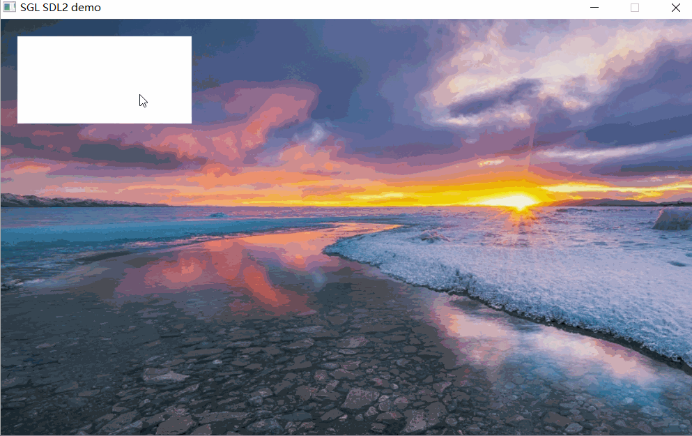
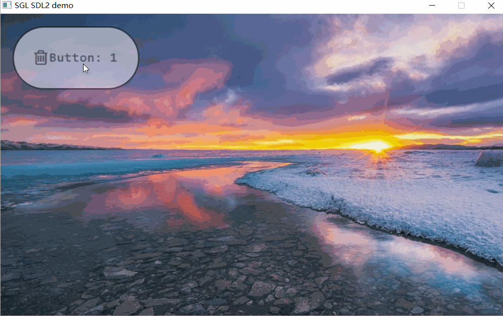
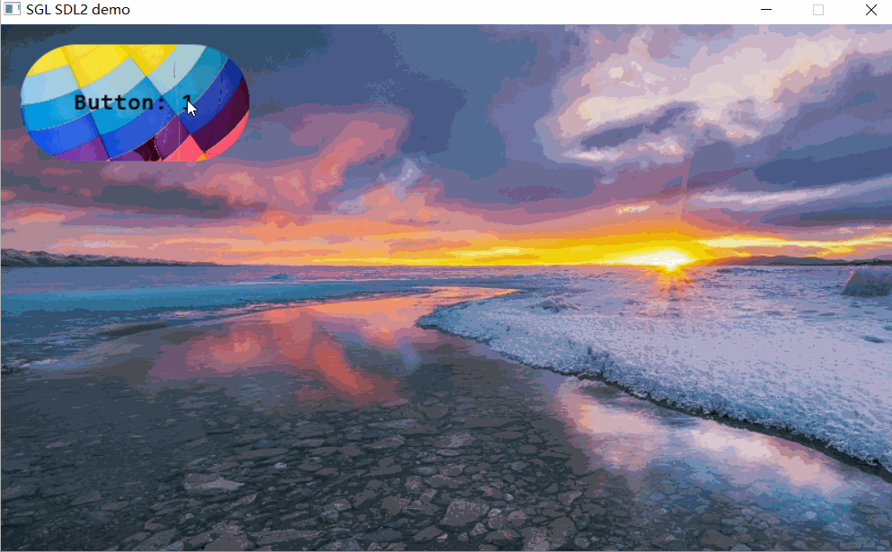

## 创建按钮
如下创建一个按钮：
```c
int main(void)
{
    ...
    sgl_obj_t *button = sgl_button_create(NULL);
    sgl_obj_set_pos(button, 20, 20);
    sgl_obj_set_size(button, 200, 100);
    ...

    while(1) {
        sgl_task_handle();
    };
}
```
效果图如下：  


设置按钮颜色相关的方法参考如下：
```c
sgl_obj_set_style(button, SGL_STYLE_COLOR, SGL_COLOR(SGL_BLUE));
sgl_obj_set_style(button, SGL_STYLE_BORDER_COLOR, SGL_COLOR(SGL_BLACK));
sgl_obj_set_style(button, SGL_STYLE_TEXT_COLOR, SGL_COLOR(SGL_GREEN));
```

## 设置按钮文本
设置按钮文本可以直接使用`sgl_obj_set_style`，也可以创建一个label控件，然后把label控件作为按钮的子控件。
### 使用SGL_STYLE_TEXT样式设置文本
```c
int main(void)
{
    ...
    sgl_obj_t *button = sgl_button_create(NULL);
    sgl_obj_set_pos(button, 20, 20);
    sgl_obj_set_size(button, 200, 100);
    sgl_obj_set_font(button, &consolas23);
    sgl_obj_set_style(button, SGL_STYLE_TEXT, SGL_TEXT("Button: 1"));
    ...

    while(1) {
        sgl_task_handle();
    };
}

```
注意，在使用`sgl_obj_set_style`函数之前必须设置样式并且样式带有字体，否则会报错。
效果如下：  


### 使用label控件来设置文本
`label`控件用于显示文本，使用如下代码来创建一个`label`控件：
```c
int main(void)
{
    ...
    sgl_obj_t *button = sgl_button_create(NULL);
    sgl_obj_set_pos(button, 20, 20);
    sgl_obj_set_size(button, 200, 100);

    sgl_obj_t *label = sgl_label_create(button);
    sgl_obj_set_font(label, &consolas23);
    sgl_obj_set_style(label, SGL_STYLE_TEXT, SGL_TEXT("Button: 1"));
    ...

    while(1) {
        sgl_task_handle();
    };
}
```
效果如下：   


## 圆角按钮
创建一个圆角按钮需要在样式表中设置`SGL_STYLE_RADIUS`属性，如下所示：
```c
int main(void)
{
    ...
    sgl_obj_t *button = sgl_button_create(NULL);
    sgl_obj_set_pos(button, 20, 20);
    sgl_obj_set_size(button, 200, 100);
    sgl_obj_set_style(button, SGL_STYLE_RADIUS, 50);
    sgl_obj_set_font(button, &consolas23);
    sgl_obj_set_style(button, SGL_STYLE_TEXT, SGL_TEXT("Button: 1"));
    ...

    while(1) {
        sgl_task_handle();
    };
}
```
效果如下：   


## 带边框的按钮
创建带边框的按钮，只需要将`SGL_STYLE_BORDER_COLOR`和`SGL_STYLE_BORDER_WIDTH`添加到`style_prop`中即可，例如下：
```c
int main(void)
{
    ...
    sgl_obj_t *button = sgl_button_create(NULL);
    sgl_obj_set_pos(button, 20, 20);
    sgl_obj_set_size(button, 200, 100);
    sgl_obj_set_style(button, SGL_STYLE_RADIUS, 50);
    sgl_obj_set_style(button, SGL_STYLE_BORDER_WIDTH, 2);
    sgl_obj_set_style(button, SGL_STYLE_BORDER_COLOR, SGL_COLOR(SGL_BLACK));
    sgl_obj_set_font(button, &consolas23);
    sgl_obj_set_style(button, SGL_STYLE_TEXT ,SGL_TEXT("Button: 1"));
    ...

    while(1) {
        sgl_task_handle();
    };
}
```
运行结果如下：   


## 透明按钮
创建透明按钮，只需要将`SGL_STYLE_ALPHA`设置为你需要的透明度即可，例如下：
```c
int main(void)
{
    ...
    sgl_obj_t *button = sgl_button_create(NULL);
    sgl_obj_set_pos(button, 20, 20);
    sgl_obj_set_size(button, 200, 100);
    sgl_obj_set_style(button, SGL_STYLE_RADIUS, 50);
    sgl_obj_set_style(button, SGL_STYLE_BORDER_WIDTH, 2);
    sgl_obj_set_style(button, SGL_STYLE_BORDER_COLOR, SGL_COLOR(SGL_BLACK));
    sgl_obj_set_style(button, SGL_STYLE_ALPHA, 128);
    sgl_obj_set_font(button, &consolas23);
    sgl_obj_set_style(button, SGL_STYLE_TEXT ,SGL_TEXT("Button: 1"));
    ...

    while(1) {
        sgl_task_handle();
    };
}
```
运行结果如下：   


## icon按钮
创建icon按钮，只需要将`SGL_STYLE_ICON`设置为图标即可，例如下面的代码：
```c
static const uint8_t default_icon_pixmap[] =
{
0x00,0x00,0x00,0x03,0x33,0x33,0x33,0x00,0x00,0x00,0x00,  //.....................
0x00,0x00,0x00,0xae,0xff,0xff,0xff,0xc0,0x00,0x00,0x00,  //......%@@@@@@@%......
0x00,0x00,0x05,0xef,0xec,0xcc,0xcf,0xe8,0x00,0x00,0x00,  //.....+@@@%%%%@@+.....
0x00,0x00,0x0a,0xfe,0x00,0x00,0x0c,0xfe,0x00,0x00,0x00,  //.....%@@.....%@@.....
0x56,0x66,0x6e,0xfc,0x66,0x66,0x6a,0xee,0x86,0x66,0x60,  //+++++@@%+++++%@@+++++
0xef,0xff,0xff,0xff,0xff,0xff,0xff,0xff,0xff,0xff,0xe0,  //@@@@@@@@@@@@@@@@@@@@@
0xac,0xee,0xaa,0xaa,0xaa,0xaa,0xaa,0xaa,0xae,0xfc,0xa0,  //%%@@%%%%%%%%%%%%%@@%%
0x05,0xee,0x30,0x00,0x00,0x00,0x00,0x00,0x0e,0xfa,0x00,  //.+@@.............@@%.
0x05,0xee,0x30,0x00,0x00,0x00,0x00,0x00,0x0e,0xfa,0x00,  //.+@@.............@@%.
0x05,0xee,0x35,0xaa,0x05,0xa8,0x08,0xa5,0x0e,0xfa,0x00,  //.+@@.+%%.+%+.+%+.@@%.
0x05,0xee,0x38,0xee,0x0a,0xfc,0x0c,0xfc,0x0e,0xfa,0x00,  //.+@@.+@@.%@%.%@%.@@%.
0x05,0xee,0x38,0xee,0x0a,0xfc,0x0c,0xfc,0x0e,0xfa,0x00,  //.+@@.+@@.%@%.%@%.@@%.
0x05,0xee,0x38,0xee,0x0a,0xfc,0x0c,0xfc,0x0e,0xfa,0x00,  //.+@@.+@@.%@%.%@%.@@%.
0x05,0xee,0x38,0xee,0x0a,0xfc,0x0c,0xfc,0x0e,0xfa,0x00,  //.+@@.+@@.%@%.%@%.@@%.
0x05,0xee,0x38,0xee,0x0a,0xfc,0x0c,0xfc,0x0e,0xfa,0x00,  //.+@@.+@@.%@%.%@%.@@%.
0x05,0xee,0x38,0xee,0x0a,0xfc,0x0c,0xfc,0x0e,0xfa,0x00,  //.+@@.+@@.%@%.%@%.@@%.
0x05,0xee,0x38,0xee,0x0a,0xfc,0x0c,0xfc,0x0e,0xfa,0x00,  //.+@@.+@@.%@%.%@%.@@%.
0x05,0xee,0x38,0xee,0x0a,0xfc,0x0c,0xfc,0x0e,0xfa,0x00,  //.+@@.+@@.%@%.%@%.@@%.
0x05,0xee,0x38,0xee,0x0a,0xfc,0x0c,0xfc,0x0e,0xfa,0x00,  //.+@@.+@@.%@%.%@%.@@%.
0x05,0xee,0x30,0x30,0x00,0x30,0x00,0x30,0x0e,0xfa,0x00,  //.+@@.............@@%.
0x05,0xee,0x30,0x00,0x00,0x00,0x00,0x00,0x0e,0xfa,0x00,  //.+@@.............@@%.
0x05,0xee,0x50,0x00,0x00,0x00,0x00,0x00,0x3e,0xe8,0x00,  //.+@@+............@@+.
0x00,0xef,0xff,0xff,0xff,0xff,0xff,0xff,0xff,0xe3,0x00,  //..@@@@@@@@@@@@@@@@@..
0x00,0x3e,0xff,0xff,0xff,0xff,0xff,0xff,0xfe,0x80,0x00,  //...@@@@@@@@@@@@@@@+..
};

static sgl_icon_pixmap_t delete_icon = {
    .bitmap = default_icon_pixmap,
    .bpp = 4,
    .height = 24,
    .width = 22,
};

int main(void)
{
    ...
    sgl_obj_t *button = sgl_button_create(NULL);
    sgl_obj_set_pos(button, 20, 20);
    sgl_obj_set_size(button, 200, 100);
    sgl_obj_set_style(button, SGL_STYLE_RADIUS, 50);
    sgl_obj_set_style(button, SGL_STYLE_BORDER_WIDTH, 2);
    sgl_obj_set_style(button, SGL_STYLE_BORDER_COLOR, SGL_COLOR(SGL_BLACK));
    sgl_obj_set_style(button, SGL_STYLE_ALPHA, 128);
    sgl_obj_set_style(button, SGL_STYLE_ICON, SGL_ICON(delete_icon));
    sgl_obj_set_font(button, &consolas23);
    sgl_obj_set_style(button, SGL_STYLE_TEXT ,SGL_TEXT("Button: 1"));
    ...

    while(1) {
        sgl_task_handle();
    };
}
```
运行结果如下：   



## 背景图片的按钮
创建背景图片按钮，只需要将`SGL_STYLE_PIXMAP`设置为图图片即可，例如下面的代码：
```c
extern const unsigned char bg_gImage[1440000];
sgl_pixmap_t bg_pixmap = {
    .width = 800,
    .height = 480,
    .bitmap = bg_gImage,
};


int main(void)
{
    sgl_device_fb_register(&fb_dev);
    sgl_device_log_register(uart_put_string);
    /* 初始化SGL库 */
    sgl_init();

    sgl_obj_t *button = sgl_button_create(NULL);
    sgl_obj_set_pos(button, 20, 20);
    sgl_obj_set_size(button, 200, 100);
    sgl_obj_set_style(button, SGL_STYLE_RADIUS, 50);
    sgl_obj_set_style(button, SGL_STYLE_BORDER_WIDTH, 2);
    sgl_obj_set_style(button, SGL_STYLE_BORDER_COLOR, SGL_COLOR(SGL_BLACK));
    sgl_obj_set_style(button, SGL_STYLE_ALPHA, 128);
    sgl_obj_set_style(button, SGL_STYLE_ICON, SGL_ICON(delete_icon));
    sgl_obj_set_font(button, &consolas23);
    sgl_obj_set_style(button, SGL_STYLE_TEXT ,SGL_TEXT("Button: 1"));
    sgl_obj_set_style(button, SGL_STYLE_PIXMAP, SGL_PIXMAP(bg_pixmap));
    ...

    while(1) {
        sgl_task_handle();
    };
}

```
运行结果如下：   

