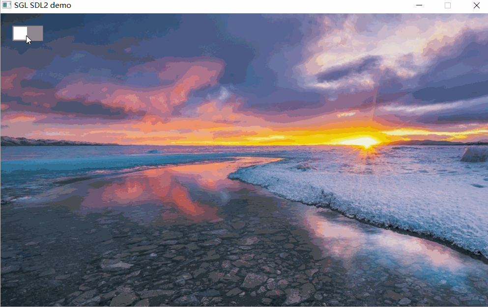
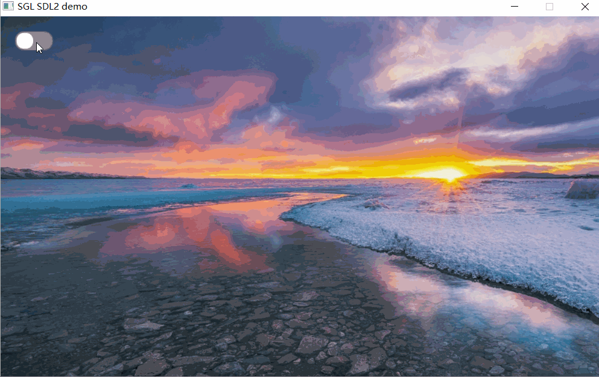
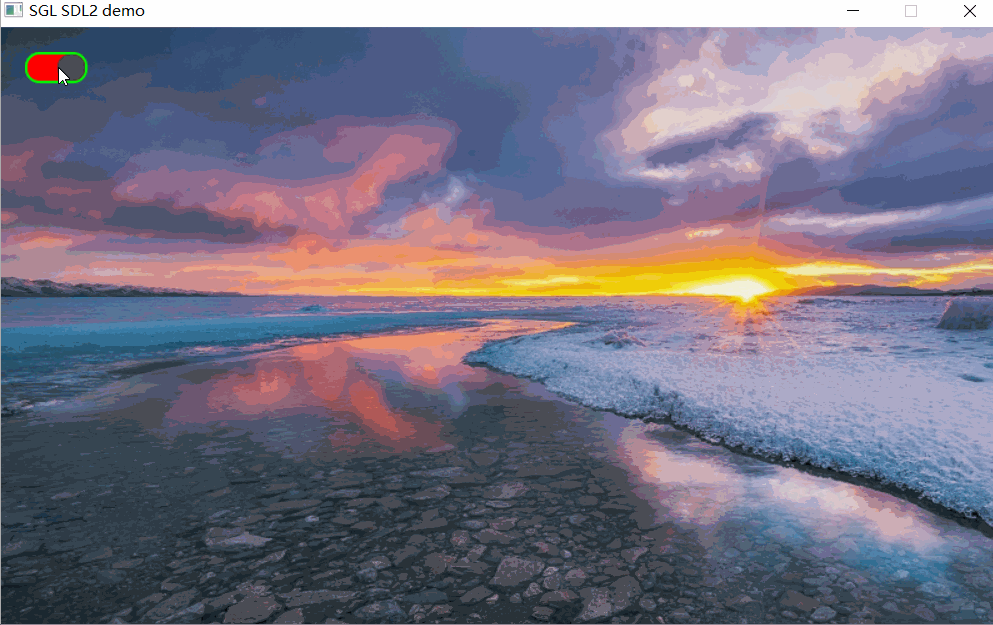

## 创建开关
如下创建一个开关：
```c
int main(void)
{
    ...
    sgl_obj_t *sw = sgl_switch_create(NULL);
    sgl_obj_set_pos(sw, 20, 20);
    sgl_obj_set_size(sw, 50, 25);
    ...

    while(1) {
        sgl_task_handle();
    };
}
```
效果图如下：  


## 设置圆角
创建开关后，可以通过`SGL_STYLE_RADIUS`来设置圆角：
```c
int main(void)
{
    ...
    sgl_obj_t *sw = sgl_switch_create(NULL);
    sgl_obj_set_pos(sw, 20, 20);
    sgl_obj_set_size(sw, 50, 25);
    sgl_obj_set_style(sw, SGL_STYLE_RADIUS, 14);
    ...

    while(1) {
        sgl_task_handle();
    };
}
```
效果图如下：   



## 设置按钮KNOB颜色
通过`SGL_STYLE_KNOB_COLOR`来设置按钮KNOB颜色：
```c
int main(void)
{
    ...
    sgl_obj_t *sw = sgl_switch_create(NULL);
    sgl_obj_set_pos(sw, 20, 20);
    sgl_obj_set_size(sw, 50, 25);
    sgl_obj_set_style(sw, SGL_STYLE_RADIUS, 14);
    sgl_obj_set_style(sw, SGL_STYLE_KNOB_COLOR, SGL_COLOR(SGL_DARK_GRAY));
    ...

    while(1) {
        sgl_task_handle();
    };
}
```
效果图如下：   


## 设置边框
通过设置`SGL_STYLE_BORDER_WIDTH`和`SGL_STYLE_BORDER_COLOR`属性，可以设置开关的边框宽度和颜色:
```c
int main(void)
{
    ...
    sgl_obj_t *sw = sgl_switch_create(NULL);
    sgl_obj_set_pos(sw, 20, 20);
    sgl_obj_set_size(sw, 50, 25);
    sgl_obj_set_style(sw, SGL_STYLE_RADIUS, 14);
    sgl_obj_set_style(sw, SGL_STYLE_KNOB_COLOR, SGL_COLOR(SGL_DARK_GRAY));
    sgl_obj_set_style(sw, SGL_STYLE_BORDER_WIDTH, 2);
    sgl_obj_set_style(sw, SGL_STYLE_BORDER_COLOR, SGL_COLOR(SGL_GREEN));
    ...

    while(1) {
        sgl_task_handle();
    };
}
```
效果图如下：   


## 获取状态
获取开关的状态可以使用`sgl_switch_get_status`函数，返回值为开关的状态，`false`表示关，`true`表示开。

## 设置状态
设置开关的状态可以使用`sgl_switch_set_status`函数，参数为开关的状态，`false`表示关，`true`表示开。
