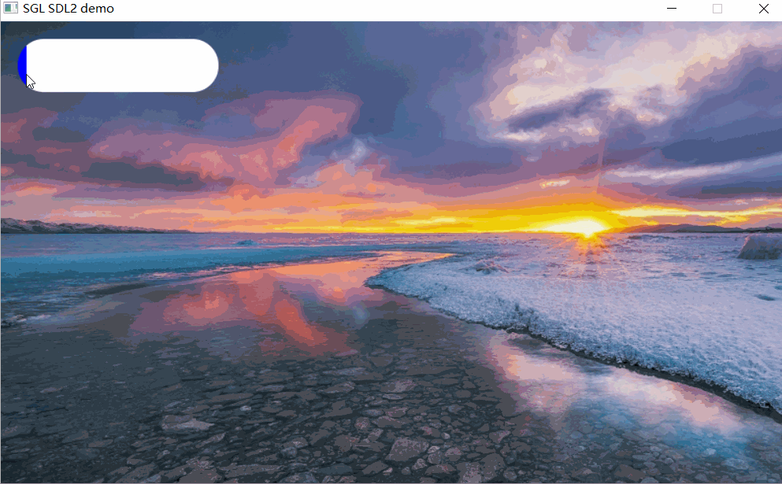
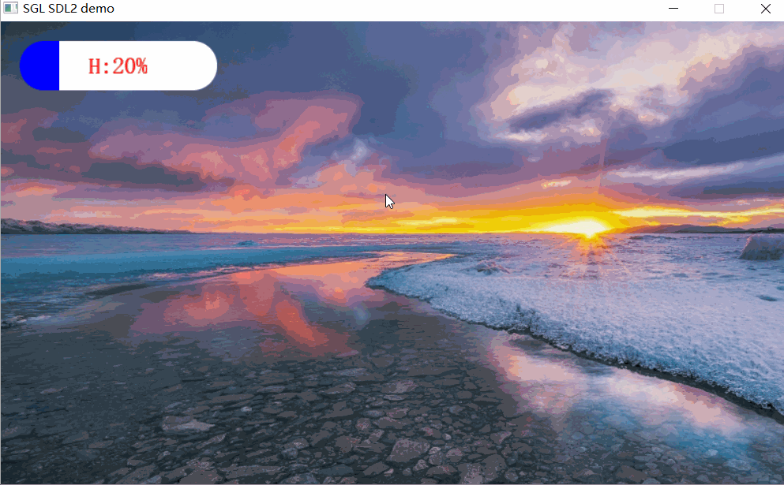
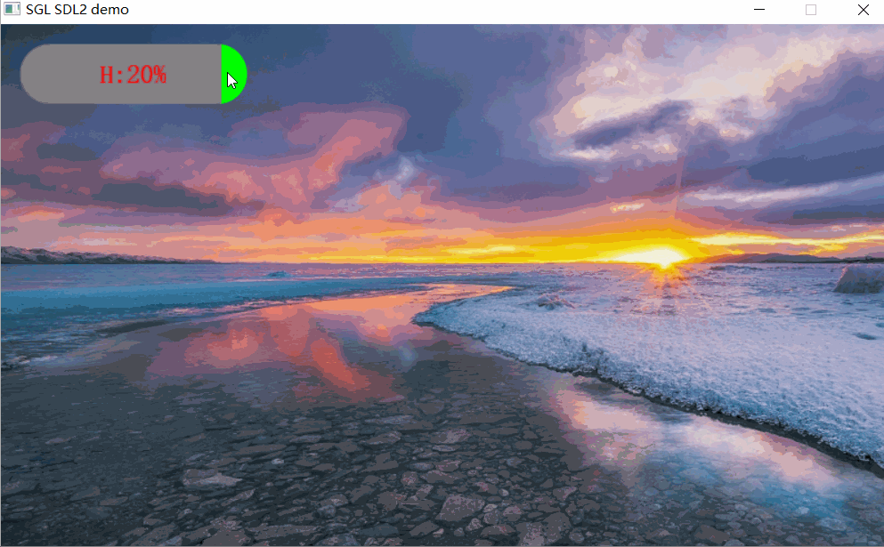
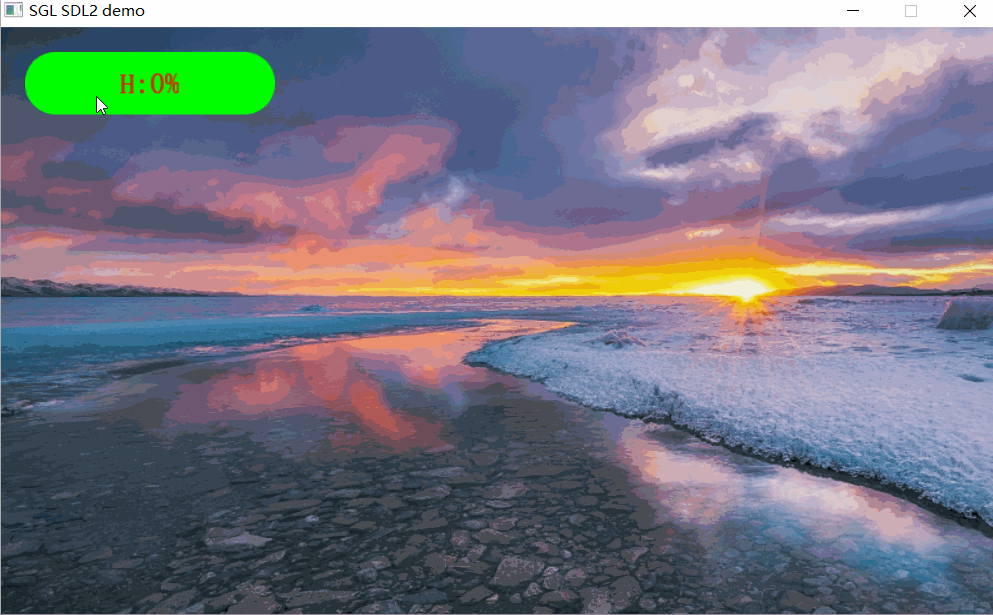

## 创建指示器
如下创建一个指示器：
```c
int main(void)
{
    ...
    sgl_obj_t *slider = sgl_slider_create(NULL);
    sgl_obj_set_pos(slider, 20, 20);
    sgl_obj_set_size(slider, 200, 50);
    ...

    while(1) {
        sgl_task_handle();
    };
}
```
效果图如下：  


## 设置指示器文本
如下使用一个`label`来设置指示器的文本显示：
```c
int main(void)
{
    ...
    sgl_obj_t *slider = sgl_slider_create(NULL);
    sgl_obj_set_pos(slider, 20, 20);
    sgl_obj_set_size(slider, 200, 50);

    sgl_obj_t *label = sgl_label_create(slider);
    sgl_obj_set_style(label, SGL_STYLE_FONT, SGL_FONT(song23));
    sgl_obj_set_style(label, SGL_STYLE_TEXT_COLOR, SGL_COLOR(SGL_RED));
    sgl_obj_set_style(label, SGL_STYLE_TEXT, SGL_TEXT("H:20%"));
    ...

    while(1) {
        sgl_task_handle();
    };
}
```
效果图如下：  


## 设置指示器的进度
使用`SGL_STYLE_VALUE`来设置指示器的进度：
```c
int main(void)
{
    ...
    sgl_obj_t *slider = sgl_slider_create(NULL);
    sgl_obj_set_pos(slider, 20, 20);
    sgl_obj_set_size(slider, 200, 50);
    sgl_obj_set_style(slider, SGL_STYLE_VALUE, 20);

    sgl_obj_t *label = sgl_label_create(slider);
    sgl_obj_set_style(label, SGL_STYLE_FONT, SGL_FONT(song23));
    sgl_obj_set_style(label, SGL_STYLE_TEXT_COLOR, SGL_COLOR(SGL_RED));
    sgl_obj_set_style(label, SGL_STYLE_TEXT, SGL_TEXT("H:20%"));
    ...

    while(1) {
        sgl_task_handle();
    };
}
```
效果图如下：  


## 设置指示器的背景颜色
使用`SGL_STYLE_BG_COLOR`来设置指示器的背景颜色：
```c
int main(void)
{
    ...
    sgl_obj_t *slider = sgl_slider_create(NULL);
    sgl_obj_set_pos(slider, 20, 20);
    sgl_obj_set_size(slider, 200, 50);
    sgl_obj_set_style(slider, SGL_STYLE_BG_COLOR, SGL_COLOR(SGL_GREEN));

    sgl_obj_t *label = sgl_label_create(slider);
    sgl_obj_set_style(label, SGL_STYLE_FONT, SGL_FONT(song23));
    sgl_obj_set_style(label, SGL_STYLE_TEXT_COLOR, SGL_COLOR(SGL_RED));
    sgl_obj_set_style(label, SGL_STYLE_TEXT, SGL_TEXT("H:20%"));
    ...

    while(1) {
        sgl_task_handle();
    };
}
```
效果图如下：  


## 设置指示器的前景颜色
使用`SGL_STYLE_COLOR`来设置指示器的前景颜色：
```c
int main(void)
{
    ...
    sgl_obj_t *slider = sgl_slider_create(NULL);
    sgl_obj_set_pos(slider, 20, 20);
    sgl_obj_set_size(slider, 200, 50);
    sgl_obj_set_style(slider, SGL_STYLE_BG_COLOR, SGL_COLOR(SGL_GREEN));
    sgl_obj_set_style(slider, SGL_STYLE_COLOR, SGL_COLOR(SGL_YELLOW));

    sgl_obj_t *label = sgl_label_create(slider);
    sgl_obj_set_style(label, SGL_STYLE_FONT, SGL_FONT(song23));
    sgl_obj_set_style(label, SGL_STYLE_TEXT_COLOR, SGL_COLOR(SGL_RED));
    sgl_obj_set_style(label, SGL_STYLE_TEXT, SGL_TEXT("H:20%"));
    ...

    while(1) {
        sgl_task_handle();
    };
}
```
效果图如下：  



## 鼠标和显示值联动
联动需要创建回调函数来实现：
```c
char buf[16] = {0};

void slider_callback(sgl_event_t *event)
{
    sgl_obj_t *label = (sgl_obj_t *)event->param;
    sprintf(buf, "H:%lld%%", sgl_obj_get_style(event->obj, SGL_STYLE_VALUE));
    sgl_obj_set_style(label, SGL_STYLE_TEXT, SGL_TEXT(buf));
}


int main(void)
{
    ...
    sgl_obj_t *slider = sgl_slider_create(NULL);
    sgl_obj_set_pos(slider, 20, 20);
    sgl_obj_set_size(slider, 200, 50);
    sgl_obj_set_style(slider, SGL_STYLE_BG_COLOR, SGL_COLOR(SGL_GREEN));
    sgl_obj_set_style(slider, SGL_STYLE_COLOR, SGL_COLOR(SGL_GRAY));

    sgl_obj_t *label = sgl_label_create(slider);
    sgl_obj_set_style(label, SGL_STYLE_FONT, SGL_FONT(song23));
    sgl_obj_set_style(label, SGL_STYLE_TEXT_COLOR, SGL_COLOR(SGL_RED));
    sgl_obj_set_style(label, SGL_STYLE_TEXT, SGL_TEXT("H:0%"));

    sgl_obj_set_event_cb(slider, slider_callback, (size_t)label);
    ...

    while(1) {
        sgl_task_handle();
    };
}
```
效果图如下：  


## 创建带边框的指示器
创建带边框的指示器，可以通过设置`SGL_STYLE_BORDER_WIDTH`和`SGL_STYLE_BORDER_COLOR`属性来设置边框的宽度和颜色：
```c
char buf[16] = {0};

void slider_callback(sgl_event_t *event)
{
    sgl_obj_t *label = (sgl_obj_t *)event->param;
    sprintf(buf, "H:%lld%%", sgl_obj_get_style(event->obj, SGL_STYLE_VALUE));
    sgl_obj_set_style(label, SGL_STYLE_TEXT, SGL_TEXT(buf));
}


int main(void)
{
    ...
    sgl_obj_t *slider = sgl_slider_create(NULL);
    sgl_obj_set_pos(slider, 20, 20);
    sgl_obj_set_size(slider, 200, 50);
    sgl_obj_set_style(slider, SGL_STYLE_BG_COLOR, SGL_COLOR(SGL_GREEN));
    sgl_obj_set_style(slider, SGL_STYLE_COLOR, SGL_COLOR(SGL_GRAY));
    sgl_obj_set_style(slider, SGL_STYLE_BORDER_WIDTH, 2);
    sgl_obj_set_style(slider, SGL_STYLE_BORDER_COLOR, SGL_COLOR(SGL_BLACK));

    sgl_obj_t *label = sgl_label_create(slider);
    sgl_obj_set_style(label, SGL_STYLE_FONT, SGL_FONT(song23));
    sgl_obj_set_style(label, SGL_STYLE_TEXT_COLOR, SGL_COLOR(SGL_RED));
    sgl_obj_set_style(label, SGL_STYLE_TEXT, SGL_TEXT("H:0%"));

    sgl_obj_set_event_cb(slider, slider_callback, (size_t)label);
    ...

    while(1) {
        sgl_task_handle();
    };
}
```
效果图如下：  

