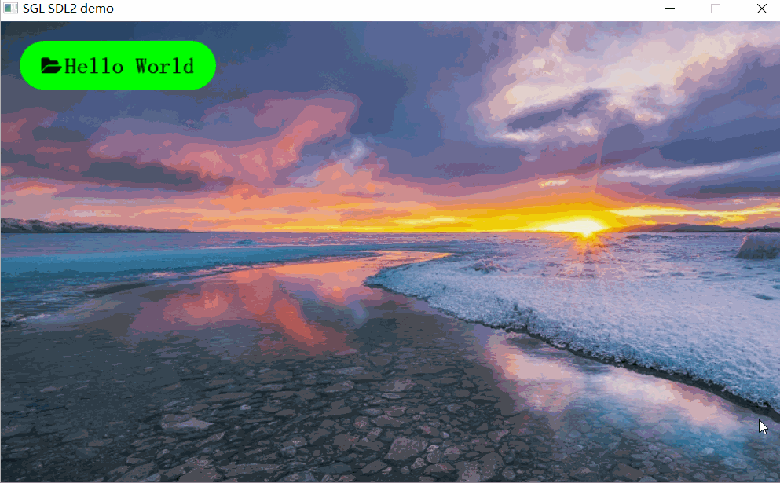
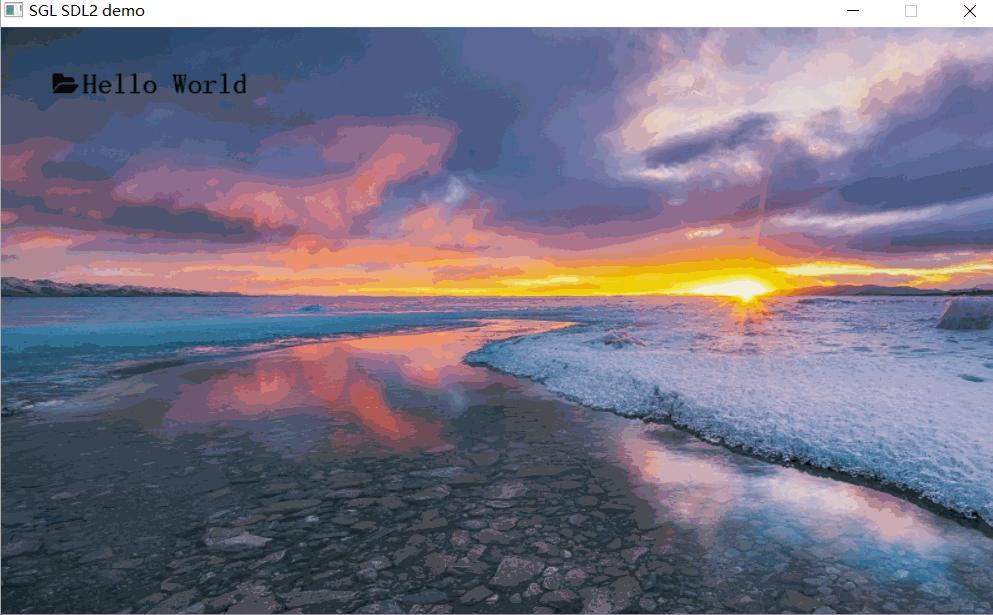
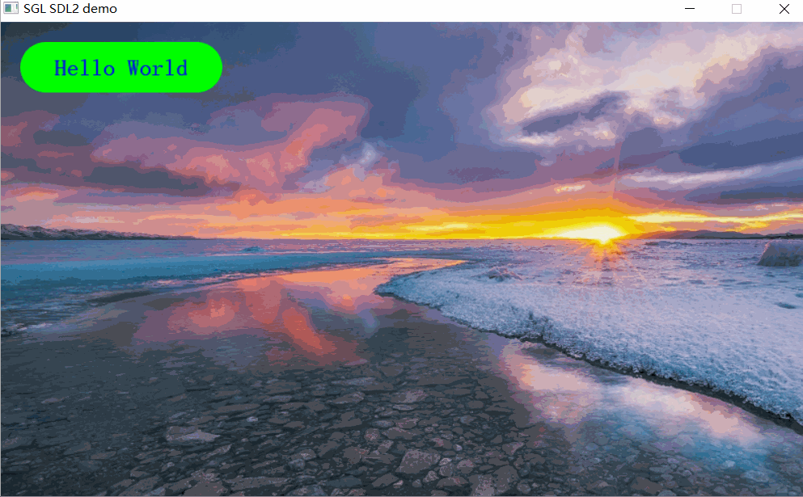

## 创建标签
如下创建一个标签：
```c
int main(void)
{
    ...
    sgl_obj_t *label = sgl_label_create(NULL);
    sgl_obj_set_pos(label, 20, 20);
    sgl_obj_set_size(label, 200, 50);
    sgl_obj_set_style(label, SGL_STYLE_FONT, SGL_FONT(song23));
    sgl_obj_set_style(label, SGL_STYLE_TEXT, SGL_TEXT("Hello World"));
    ...

    while(1) {
        sgl_task_handle();
    };
}
```
注意：字体必须设置，否则会进入`ASSERT`    
效果图如下：  


## 创建带背景的标签
创建带背景的标签，可以通过设置`SGL_STYLE_BG_COLOR`属性来设置标签的背景颜色：
```c
int main(void)
{
    ...
    sgl_obj_t *label = sgl_label_create(NULL);
    sgl_obj_set_pos(label, 20, 20);
    sgl_obj_set_size(label, 200, 50);
    sgl_obj_set_style(label, SGL_STYLE_BG_COLOR, SGL_COLOR(SGL_GREEN));
    sgl_obj_set_style(label, SGL_STYLE_FONT, SGL_FONT(song23));
    sgl_obj_set_style(label, SGL_STYLE_TEXT, SGL_TEXT("Hello World"));
    ...

    while(1) {
        sgl_task_handle();
    };
}
```
注意：字体必须设置，否则会进入`ASSERT`     
效果图如下：  


## 创建圆角的标签
创建圆角的标签，可以通过设置`SGL_STYLE_RADIUS`属性来设置标签的圆角半径：
```c
int main(void)
{
    ...
    sgl_obj_t *label = sgl_label_create(NULL);
    sgl_obj_set_pos(label, 20, 20);
    sgl_obj_set_size(label, 200, 50);
    sgl_obj_set_style(label, SGL_STYLE_RADIUS, 25);
    sgl_obj_set_style(label, SGL_STYLE_BG_COLOR, SGL_COLOR(SGL_GREEN));
    sgl_obj_set_style(label, SGL_STYLE_FONT, SGL_FONT(song23));
    sgl_obj_set_style(label, SGL_STYLE_TEXT, SGL_TEXT("Hello World"));
    ...

    while(1) {
        sgl_task_handle();
    };
}
```
注意：字体必须设置，否则会进入`ASSERT`      
效果图如下：  


## 创建ICON的标签
创建ICON的标签，可以通过设置`SGL_STYLE_ICON`属性来设置标签的图标：
```c
static const uint8_t folder_icon_pixmap[] = {
0x3a,0xcc,0xcc,0xc8,0x00,0x00,0x00,0x00,0x00,0x00,0x00,  //.%%%%%%+.............
0xef,0xff,0xff,0xfe,0x80,0x00,0x00,0x00,0x00,0x00,0x00,  //@@@@@@@@+............
0xef,0xff,0xff,0xff,0xc0,0x00,0x00,0x00,0x00,0x00,0x00,  //@@@@@@@@%............
0xef,0xff,0xff,0xff,0xec,0xcc,0xcc,0xcc,0x50,0x00,0x00,  //@@@@@@@@@%%%%%%%+....
0xef,0xff,0xff,0xff,0xff,0xff,0xff,0xff,0xe3,0x00,0x00,  //@@@@@@@@@@@@@@@@@....
0xef,0xff,0xff,0xff,0xff,0xff,0xff,0xff,0xe8,0x00,0x00,  //@@@@@@@@@@@@@@@@@+...
0xef,0xff,0xff,0xff,0xff,0xff,0xff,0xff,0xe8,0x00,0x00,  //@@@@@@@@@@@@@@@@@+...
0xef,0xff,0xff,0xc8,0x66,0x66,0x66,0x66,0x63,0x00,0x00,  //@@@@@@%++++++++++....
0xef,0xff,0xc3,0x03,0x33,0x33,0x33,0x33,0x33,0x33,0x00,  //@@@@%................
0xef,0xfe,0x08,0xef,0xff,0xff,0xff,0xff,0xff,0xff,0xe0,  //@@@@.+@@@@@@@@@@@@@@@
0xef,0xe3,0xaf,0xff,0xff,0xff,0xff,0xff,0xff,0xff,0xa0,  //@@@.%@@@@@@@@@@@@@@@%
0xee,0x58,0xef,0xff,0xff,0xff,0xff,0xff,0xff,0xfc,0x00,  //@@++@@@@@@@@@@@@@@@%.
0xc8,0x5e,0xff,0xff,0xff,0xff,0xff,0xff,0xff,0xe0,0x00,  //%++@@@@@@@@@@@@@@@@..
0x53,0xef,0xff,0xff,0xff,0xff,0xff,0xff,0xfe,0x30,0x00,  //+.@@@@@@@@@@@@@@@@...
0x0e,0xff,0xff,0xff,0xff,0xff,0xff,0xff,0xe5,0x00,0x00,  //.@@@@@@@@@@@@@@@@+...
0x8e,0xff,0xff,0xff,0xff,0xff,0xff,0xfc,0x30,0x00,0x00,  //+@@@@@@@@@@@@@@%.....
};


static sgl_icon_pixmap_t folder_icon = {
    .bitmap = folder_icon_pixmap,
    .bpp = 4,
    .height = 16,
    .width = 22,
};

int main(void)
{
    ...
    sgl_obj_t *label = sgl_label_create(NULL);
    sgl_obj_set_pos(label, 20, 20);
    sgl_obj_set_size(label, 200, 50);
    sgl_obj_set_style(label, SGL_STYLE_RADIUS, 25);
    sgl_obj_set_style(label, SGL_STYLE_BG_COLOR, SGL_COLOR(SGL_GREEN));
    sgl_obj_set_style(label, SGL_STYLE_FONT, SGL_FONT(song23));
    sgl_obj_set_style(label, SGL_STYLE_TEXT, SGL_TEXT("Hello World"));
    sgl_obj_set_style(label, SGL_STYLE_ICON, SGL_ICON(folder_icon));
    ...

    while(1) {
        sgl_task_handle();
    };
}
```
注意：字体必须设置，否则会进入`ASSERT`      
效果图如下：  


## 创建背景透明的标签
创建背景透明的标签，可以通过设置`SGL_STYLE_TRANSPARENT`属性来设置标签的背景透明：
```c
static const uint8_t folder_icon_pixmap[] = {
0x3a,0xcc,0xcc,0xc8,0x00,0x00,0x00,0x00,0x00,0x00,0x00,  //.%%%%%%+.............
0xef,0xff,0xff,0xfe,0x80,0x00,0x00,0x00,0x00,0x00,0x00,  //@@@@@@@@+............
0xef,0xff,0xff,0xff,0xc0,0x00,0x00,0x00,0x00,0x00,0x00,  //@@@@@@@@%............
0xef,0xff,0xff,0xff,0xec,0xcc,0xcc,0xcc,0x50,0x00,0x00,  //@@@@@@@@@%%%%%%%+....
0xef,0xff,0xff,0xff,0xff,0xff,0xff,0xff,0xe3,0x00,0x00,  //@@@@@@@@@@@@@@@@@....
0xef,0xff,0xff,0xff,0xff,0xff,0xff,0xff,0xe8,0x00,0x00,  //@@@@@@@@@@@@@@@@@+...
0xef,0xff,0xff,0xff,0xff,0xff,0xff,0xff,0xe8,0x00,0x00,  //@@@@@@@@@@@@@@@@@+...
0xef,0xff,0xff,0xc8,0x66,0x66,0x66,0x66,0x63,0x00,0x00,  //@@@@@@%++++++++++....
0xef,0xff,0xc3,0x03,0x33,0x33,0x33,0x33,0x33,0x33,0x00,  //@@@@%................
0xef,0xfe,0x08,0xef,0xff,0xff,0xff,0xff,0xff,0xff,0xe0,  //@@@@.+@@@@@@@@@@@@@@@
0xef,0xe3,0xaf,0xff,0xff,0xff,0xff,0xff,0xff,0xff,0xa0,  //@@@.%@@@@@@@@@@@@@@@%
0xee,0x58,0xef,0xff,0xff,0xff,0xff,0xff,0xff,0xfc,0x00,  //@@++@@@@@@@@@@@@@@@%.
0xc8,0x5e,0xff,0xff,0xff,0xff,0xff,0xff,0xff,0xe0,0x00,  //%++@@@@@@@@@@@@@@@@..
0x53,0xef,0xff,0xff,0xff,0xff,0xff,0xff,0xfe,0x30,0x00,  //+.@@@@@@@@@@@@@@@@...
0x0e,0xff,0xff,0xff,0xff,0xff,0xff,0xff,0xe5,0x00,0x00,  //.@@@@@@@@@@@@@@@@+...
0x8e,0xff,0xff,0xff,0xff,0xff,0xff,0xfc,0x30,0x00,0x00,  //+@@@@@@@@@@@@@@%.....
};


static sgl_icon_pixmap_t folder_icon = {
    .bitmap = folder_icon_pixmap,
    .bpp = 4,
    .height = 16,
    .width = 22,
};

int main(void)
{
    ...
    sgl_obj_t *label = sgl_label_create(NULL);
    sgl_obj_set_pos(label, 20, 20);
    sgl_obj_set_size(label, 200, 50);
    sgl_obj_set_style(label, SGL_STYLE_RADIUS, 25);
    sgl_obj_set_style(label, SGL_STYLE_BG_COLOR, SGL_COLOR(SGL_GREEN));
    sgl_obj_set_style(label, SGL_STYLE_FONT, SGL_FONT(song23));
    sgl_obj_set_style(label, SGL_STYLE_TEXT, SGL_TEXT("Hello World"));
    sgl_obj_set_style(label, SGL_STYLE_ICON, SGL_ICON(folder_icon));
    sgl_obj_set_style(label, SGL_STYLE_BG_TRANSPARENT, 1);
    ...

    while(1) {
        sgl_task_handle();
    };
}
```
注意：字体必须设置，否则会进入`ASSERT`     
效果图如下：  


## 设置标签的字体颜色
设置标签字体颜色，可以通过设置`SGL_STYLE_TEXT_COLOR`属性来设置标签的字体颜色：
```c
int main(void)
{
    ...
    sgl_obj_t *label = sgl_label_create(NULL);
    sgl_obj_set_pos(label, 20, 20);
    sgl_obj_set_size(label, 200, 50);
    sgl_obj_set_style(label, SGL_STYLE_RADIUS, 25);
    sgl_obj_set_style(label, SGL_STYLE_BG_COLOR, SGL_COLOR(SGL_GREEN));
    sgl_obj_set_style(label, SGL_STYLE_FONT, SGL_FONT(song23));
    sgl_obj_set_style(label, SGL_STYLE_TEXT, SGL_TEXT("Hello World"));
    sgl_obj_set_style(label, SGL_STYLE_TEXT_COLOR, 0xF503);
    ...

    while(1) {
        sgl_task_handle();
    };
}
```
注意：字体必须设置，否则会进入`ASSERT`      
效果图如下：  

