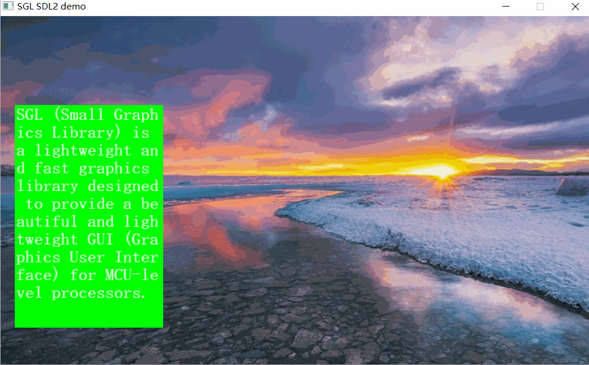
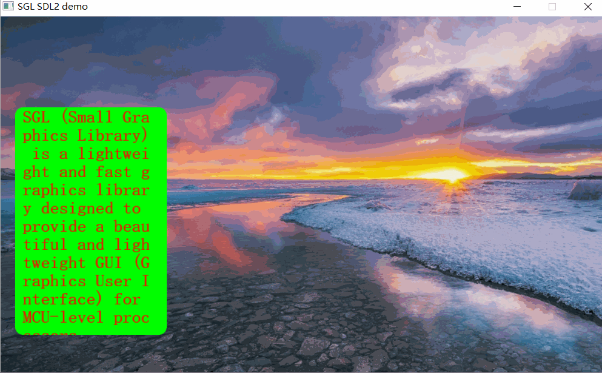
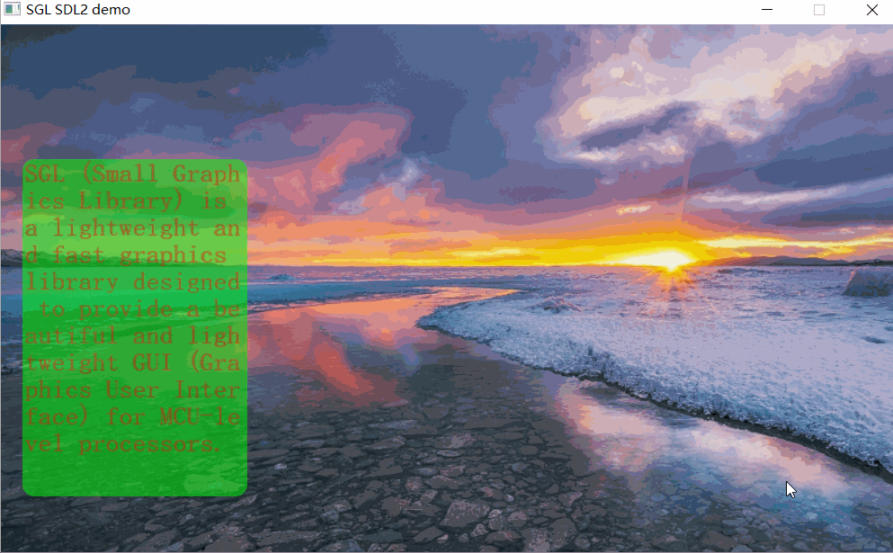
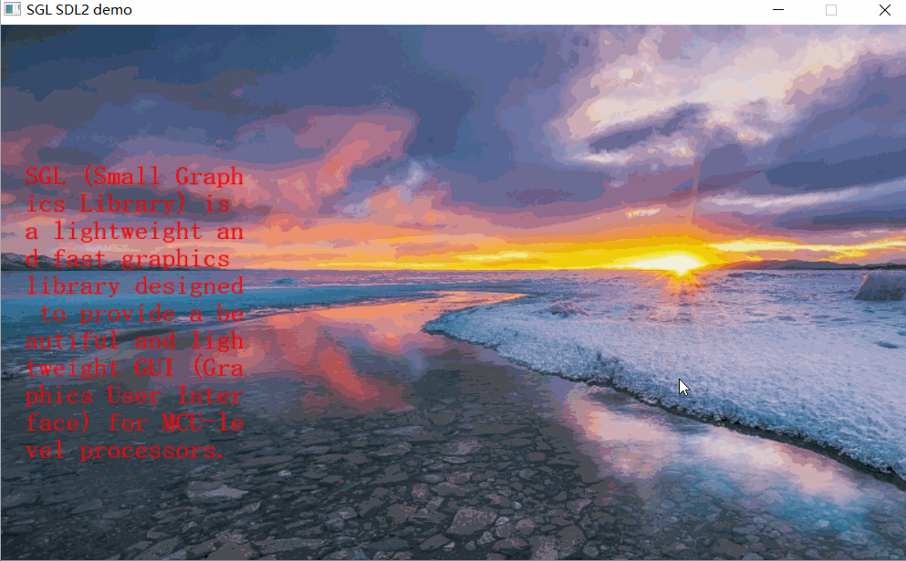

## 创建多行文本
如下代码创建一个多行文本：
```c
int main(void)
{
    ...
    sgl_obj_t *textline = sgl_textline_create(NULL);
    sgl_obj_set_pos(textline, 20, 120);
    sgl_obj_set_size(textline, 200, 300);
    sgl_obj_set_style(textline, SGL_STYLE_FONT, SGL_FONT(song23));
    sgl_obj_set_style(textline, SGL_STYLE_TEXT, SGL_TEXT("SGL (Small Graphics Library) is a lightweight and fast graphics library designed to provide a beautiful and lightweight GUI (Graphics User Interface) for MCU-level processors."));
    ...

    while(1) {
        sgl_task_handle();
    };
}
```
注意：字体必须设置，否则会进入`ASSERT`    
效果图如下：  


## 设置背景颜色
设置多行文本的背景颜色，可以通过设置`SGL_STYLE_BG_COLOR`属性来设置多行文本的背景颜色：
```c
int main(void)
{
    ...
    sgl_obj_t *textline = sgl_textline_create(NULL);
    sgl_obj_set_pos(textline, 20, 120);
    sgl_obj_set_size(textline, 200, 300);
    sgl_obj_set_style(textline, SGL_STYLE_FONT, SGL_FONT(song23));
    sgl_obj_set_style(textline, SGL_STYLE_TEXT, SGL_TEXT("SGL (Small Graphics Library) is a lightweight and fast graphics library designed to provide a beautiful and lightweight GUI (Graphics User Interface) for MCU-level processors."));
    sgl_obj_set_style(textline, SGL_STYLE_BG_COLOR, SGL_COLOR(SGL_GREEN));
    ...

    while(1) {
        sgl_task_handle();
    };
}
```
注意：字体必须设置，否则会进入`ASSERT`    
效果图如下：  


## 设置字体颜色
设置多行文本的字体颜色，可以通过设置`SGL_STYLE_TEXT_COLOR`属性来设置多行文本的字体颜色：
```c
int main(void)
{
    ...
    sgl_obj_t *textline = sgl_textline_create(NULL);
    sgl_obj_set_pos(textline, 20, 120);
    sgl_obj_set_size(textline, 200, 300);
    sgl_obj_set_style(textline, SGL_STYLE_FONT, SGL_FONT(song23));
    sgl_obj_set_style(textline, SGL_STYLE_TEXT, SGL_TEXT("SGL (Small Graphics Library) is a lightweight and fast graphics library designed to provide a beautiful and lightweight GUI (Graphics User Interface) for MCU-level processors."));
    sgl_obj_set_style(textline, SGL_STYLE_BG_COLOR, SGL_COLOR(SGL_GREEN));
    sgl_obj_set_style(textline, SGL_STYLE_TEXT_COLOR, SGL_COLOR(SGL_RED));
    ...

    while(1) {
        sgl_task_handle();
    };
}
```
注意：字体必须设置，否则会进入`ASSERT`    
效果图如下：  


## 设置背景圆角
设置多行文本的背景圆角，可以通过设置`SGL_STYLE_RADIUS`属性来设置多行文本的背景圆角：
```c
int main(void)
{
    ...
    sgl_obj_t *textline = sgl_textline_create(NULL);
    sgl_obj_set_pos(textline, 20, 120);
    sgl_obj_set_size(textline, 200, 300);
    sgl_obj_set_style(textline, SGL_STYLE_FONT, SGL_FONT(song23));
    sgl_obj_set_style(textline, SGL_STYLE_TEXT, SGL_TEXT("SGL (Small Graphics Library) is a lightweight and fast graphics library designed to provide a beautiful and lightweight GUI (Graphics User Interface) for MCU-level processors."));
    sgl_obj_set_style(textline, SGL_STYLE_BG_COLOR, SGL_COLOR(SGL_GREEN));
    sgl_obj_set_style(textline, SGL_STYLE_TEXT_COLOR, SGL_COLOR(SGL_RED));
    sgl_obj_set_style(textline, SGL_STYLE_RADIUS, 10);
    ...

    while(1) {
        sgl_task_handle();
    };
}
```
注意：字体必须设置，否则会进入`ASSERT`    
效果图如下：  


## 设置设置边界距离
设置多行文本的边界距离，可以通过设置`SGL_STYLE_TEXT_MARGIN`属性来设置多行文本的边界距离：
```c
int main(void)
{
    ...
    sgl_obj_t *textline = sgl_textline_create(NULL);
    sgl_obj_set_pos(textline, 20, 120);
    sgl_obj_set_size(textline, 200, 300);
    sgl_obj_set_style(textline, SGL_STYLE_FONT, SGL_FONT(song23));
    sgl_obj_set_style(textline, SGL_STYLE_TEXT, SGL_TEXT("SGL (Small Graphics Library) is a lightweight and fast graphics library designed to provide a beautiful and lightweight GUI (Graphics User Interface) for MCU-level processors."));
    sgl_obj_set_style(textline, SGL_STYLE_BG_COLOR, SGL_COLOR(SGL_GREEN));
    sgl_obj_set_style(textline, SGL_STYLE_TEXT_COLOR, SGL_COLOR(SGL_RED));
    sgl_obj_set_style(textline, SGL_STYLE_RADIUS, 10);
    sgl_obj_set_style(textline, SGL_STYLE_TEXT_MARGIN, 10);
    ...

    while(1) {
        sgl_task_handle();
    };
}
```
注意：字体必须设置，否则会进入`ASSERT`    
效果图如下：  


## 设置文本Y偏移量
设置多行文本的Y偏移量，可以通过设置`SGL_STYLE_TEXT_Y_OFFSET`属性来设置多行文本的Y偏移量：
```c
int main(void)
{
    ...
    sgl_obj_t *textline = sgl_textline_create(NULL);
    sgl_obj_set_pos(textline, 20, 120);
    sgl_obj_set_size(textline, 200, 300);
    sgl_obj_set_style(textline, SGL_STYLE_FONT, SGL_FONT(song23));
    sgl_obj_set_style(textline, SGL_STYLE_TEXT, SGL_TEXT("SGL (Small Graphics Library) is a lightweight and fast graphics library designed to provide a beautiful and lightweight GUI (Graphics User Interface) for MCU-level processors."));
    sgl_obj_set_style(textline, SGL_STYLE_BG_COLOR, SGL_COLOR(SGL_GREEN));
    sgl_obj_set_style(textline, SGL_STYLE_TEXT_COLOR, SGL_COLOR(SGL_RED));
    sgl_obj_set_style(textline, SGL_STYLE_RADIUS, 10);
    sgl_obj_set_style(textline, SGL_STYLE_TEXT_MARGIN, 10);
    sgl_obj_set_style(textline, SGL_STYLE_TEXT_Y_OFFSET, 10);
    ...

    while(1) {
        sgl_task_handle();
    };
}
```
注意：字体必须设置，否则会进入`ASSERT`    
效果图如下：  


## 设置透明度
设置多行文本的透明度，可以通过设置`SGL_STYLE_ALPHA`属性来设置多行文本的透明度：
```c
int main(void)
{
    ...
    sgl_obj_t *textline = sgl_textline_create(NULL);
    sgl_obj_set_pos(textline, 20, 120);
    sgl_obj_set_size(textline, 200, 300);
    sgl_obj_set_style(textline, SGL_STYLE_FONT, SGL_FONT(song23));
    sgl_obj_set_style(textline, SGL_STYLE_TEXT, SGL_TEXT("SGL (Small Graphics Library) is a lightweight and fast graphics library designed to provide a beautiful and lightweight GUI (Graphics User Interface) for MCU-level processors."));
    sgl_obj_set_style(textline, SGL_STYLE_BG_COLOR, SGL_COLOR(SGL_GREEN));
    sgl_obj_set_style(textline, SGL_STYLE_TEXT_COLOR, SGL_COLOR(SGL_RED));
    sgl_obj_set_style(textline, SGL_STYLE_RADIUS, 10);
    sgl_obj_set_style(textline, SGL_STYLE_ALPHA, 128);
    ...

    while(1) {
        sgl_task_handle();
    };
}
```
注意：字体必须设置，否则会进入`ASSERT`    
效果图如下：  


## 不显示背景
如果不想显示多行文本的背景，可以通过设置`SGL_STYLE_BG_TRANSPARENT`为1来禁止背景显示：
```c
int main(void)
{
    ...
    sgl_obj_t *textline = sgl_textline_create(NULL);
    sgl_obj_set_pos(textline, 20, 120);
    sgl_obj_set_size(textline, 200, 300);
    sgl_obj_set_style(textline, SGL_STYLE_FONT, SGL_FONT(song23));
    sgl_obj_set_style(textline, SGL_STYLE_TEXT, SGL_TEXT("SGL (Small Graphics Library) is a lightweight and fast graphics library designed to provide a beautiful and lightweight GUI (Graphics User Interface) for MCU-level processors."));
    sgl_obj_set_style(textline, SGL_STYLE_BG_COLOR, SGL_COLOR(SGL_GREEN));
    sgl_obj_set_style(textline, SGL_STYLE_TEXT_COLOR, SGL_COLOR(SGL_RED));
    sgl_obj_set_style(textline, SGL_STYLE_RADIUS, 10);
    sgl_obj_set_style(textline, SGL_STYLE_BG_TRANSPARENT, 1);
    ...

    while(1) {
        sgl_task_handle();
    };
}
```
注意：字体必须设置，否则会进入`ASSERT`    
效果图如下：  


