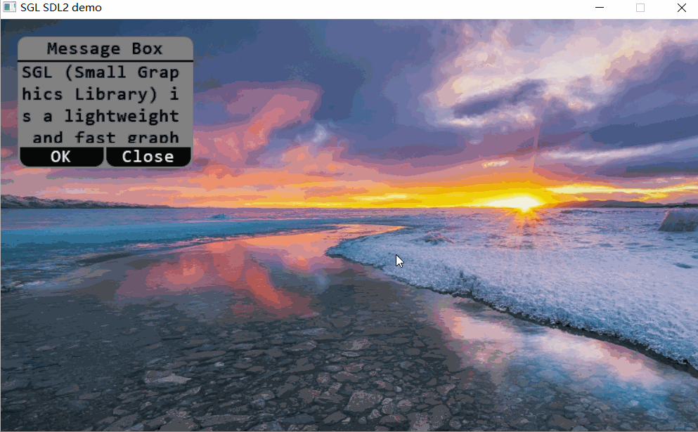
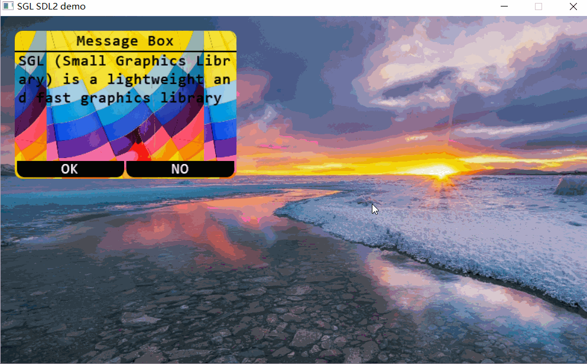
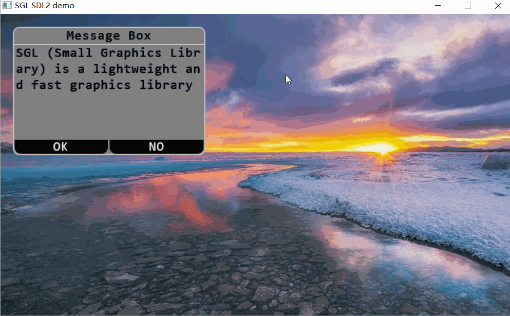

## 创建消息框
如下代码创建一个消息框：
```c
int main(void)
{
    ...
    sgl_obj_t *msgbox = sgl_msgbox_create(NULL);
    sgl_obj_set_pos(msgbox, 20, 20);
    sgl_obj_set_size(msgbox, 200, 150);
    sgl_obj_set_style(msgbox, SGL_STYLE_FONT, SGL_FONT(consolas23));
    sgl_obj_set_style(msgbox, SGL_STYLE_MSGBOX_TITLE, SGL_TEXT("Message Box"));
    sgl_obj_set_style(msgbox, SGL_STYLE_MSGBOX_TEXT, SGL_TEXT("SGL (Small Graphics Library) is a lightweight and fast graphics library"));
    ...

    while(1) {
        sgl_task_handle();
    };
}
```
注意：字体必须设置，否则会进入`ASSERT`    
效果图如下：  


## 设置圆角
设置消息框的圆角，可以通过设置`SGL_STYLE_RADIUS`属性来设置消息框的圆角：
```c
int main(void)
{
    ...
    sgl_obj_t *msgbox = sgl_msgbox_create(NULL);
    sgl_obj_set_pos(msgbox, 20, 20);
    sgl_obj_set_size(msgbox, 200, 150);
    sgl_obj_set_style(msgbox, SGL_STYLE_FONT, SGL_FONT(consolas23));
    sgl_obj_set_style(msgbox, SGL_STYLE_MSGBOX_TITLE, SGL_TEXT("Message Box"));
    sgl_obj_set_style(msgbox, SGL_STYLE_MSGBOX_TEXT, SGL_TEXT("SGL (Small Graphics Library) is a lightweight and fast graphics library"));
    sgl_obj_set_style(msgbox, SGL_STYLE_RADIUS, 10);
    ...

    while(1) {
        sgl_task_handle();
    };
}
```
注意：字体必须设置，否则会进入`ASSERT`    
效果图如下：  


## 设置应用按钮文本
设置消息框的应用按钮文本，可以通过设置`SGL_STYLE_MSGBOX_APPLY_TEXT`属性来设置消息框的应用按钮文本：
```c
int main(void)
{
    ...
    sgl_obj_t *msgbox = sgl_msgbox_create(NULL);
    sgl_obj_set_pos(msgbox, 20, 20);
    sgl_obj_set_size(msgbox, 200, 150);
    sgl_obj_set_style(msgbox, SGL_STYLE_FONT, SGL_FONT(consolas23));
    sgl_obj_set_style(msgbox, SGL_STYLE_MSGBOX_TITLE, SGL_TEXT("Message Box"));
    sgl_obj_set_style(msgbox, SGL_STYLE_MSGBOX_TEXT, SGL_TEXT("SGL (Small Graphics Library) is a lightweight and fast graphics library"));
    sgl_obj_set_style(msgbox, SGL_STYLE_RADIUS, 10);
    sgl_obj_set_style(msgbox, SGL_STYLE_MSGBOX_APPLY_TEXT, SGL_TEXT("OK"));
    ...

    while(1) {
        sgl_task_handle();
    };
}
```
注意：字体必须设置，否则会进入`ASSERT`    
效果图如下：  


## 设置关闭按钮文本
设置消息框的关闭按钮文本，可以通过设置`SGL_STYLE_MSGBOX_CLOSE_TEXT`属性来设置消息框的关闭按钮文本：
```c
int main(void)
{
    ...
    sgl_obj_t *msgbox = sgl_msgbox_create(NULL);
    sgl_obj_set_pos(msgbox, 20, 20);
    sgl_obj_set_size(msgbox, 200, 150);
    sgl_obj_set_style(msgbox, SGL_STYLE_FONT, SGL_FONT(consolas23));
    sgl_obj_set_style(msgbox, SGL_STYLE_MSGBOX_TITLE, SGL_TEXT("Message Box"));
    sgl_obj_set_style(msgbox, SGL_STYLE_MSGBOX_TEXT, SGL_TEXT("SGL (Small Graphics Library) is a lightweight and fast graphics library"));
    sgl_obj_set_style(msgbox, SGL_STYLE_RADIUS, 10);
    sgl_obj_set_style(msgbox, SGL_STYLE_MSGBOX_APPLY_TEXT, SGL_TEXT("OK"));
    sgl_obj_set_style(msgbox, SGL_STYLE_MSGBOX_CLOSE_TEXT, SGL_TEXT("NO"));
    ...

    while(1) {
        sgl_task_handle();
    };
}
```
注意：字体必须设置，否则会进入`ASSERT`    
效果图如下：  


## 设置背景图片
设置消息框的背景图片，可以通过设置`SGL_STYLE_PIXMAP`属性来设置消息框的背景图片：
```c
extern const unsigned char gImage_bg[272640];
sgl_pixmap_t bg_pixmap = {
    .width = 213,
    .height = 320,
    .bitmap = gImage_bg,
};

int main(void)
{
    ...
    sgl_obj_t *msgbox = sgl_msgbox_create(NULL);
    sgl_obj_set_pos(msgbox, 20, 20);
    sgl_obj_set_size(msgbox, 300, 200);
    sgl_obj_set_style(msgbox, SGL_STYLE_FONT, SGL_FONT(consolas23));
    sgl_obj_set_style(msgbox, SGL_STYLE_MSGBOX_TITLE, SGL_TEXT("Message Box"));
    sgl_obj_set_style(msgbox, SGL_STYLE_MSGBOX_TEXT, SGL_TEXT("SGL (Small Graphics Library) is a lightweight and fast graphics library"));
    sgl_obj_set_style(msgbox, SGL_STYLE_RADIUS, 10);
    sgl_obj_set_style(msgbox, SGL_STYLE_MSGBOX_APPLY_TEXT, SGL_TEXT("OK"));
    sgl_obj_set_style(msgbox, SGL_STYLE_MSGBOX_CLOSE_TEXT, SGL_TEXT("NO"));
    sgl_obj_set_style(msgbox, SGL_STYLE_PIXMAP, SGL_PIXMAP(bg_pixmap));
    ...

    while(1) {
        sgl_task_handle();
    };
}
```
注意：字体必须设置，否则会进入`ASSERT`    
效果图如下：  


## 设置边框
设置消息框的边框，可以通过设置`SGL_STYLE_BORDER_WIDTH`属性来设置消息框的边框宽度，`SGL_STYLE_BORDER_COLOR`属性来设置消息框的边框颜色：
```c
int main(void)
{
    ...
    sgl_obj_t *msgbox = sgl_msgbox_create(NULL);
    sgl_obj_set_pos(msgbox, 20, 20);
    sgl_obj_set_size(msgbox, 300, 200);
    sgl_obj_set_style(msgbox, SGL_STYLE_FONT, SGL_FONT(consolas23));
    sgl_obj_set_style(msgbox, SGL_STYLE_MSGBOX_TITLE, SGL_TEXT("Message Box"));
    sgl_obj_set_style(msgbox, SGL_STYLE_MSGBOX_TEXT, SGL_TEXT("SGL (Small Graphics Library) is a lightweight and fast graphics library"));
    sgl_obj_set_style(msgbox, SGL_STYLE_RADIUS, 10);
    sgl_obj_set_style(msgbox, SGL_STYLE_MSGBOX_APPLY_TEXT, SGL_TEXT("OK"));
    sgl_obj_set_style(msgbox, SGL_STYLE_MSGBOX_CLOSE_TEXT, SGL_TEXT("NO"));
    sgl_obj_set_style(msgbox, SGL_STYLE_BORDER_WIDTH, 2);
    sgl_obj_set_style(msgbox, SGL_STYLE_BORDER_COLOR, SGL_COLOR(SGL_LIGHT_GRAY));
    ...

    while(1) {
        sgl_task_handle();
    };
}
```
注意：字体必须设置，否则会进入`ASSERT`    
效果图如下：  


