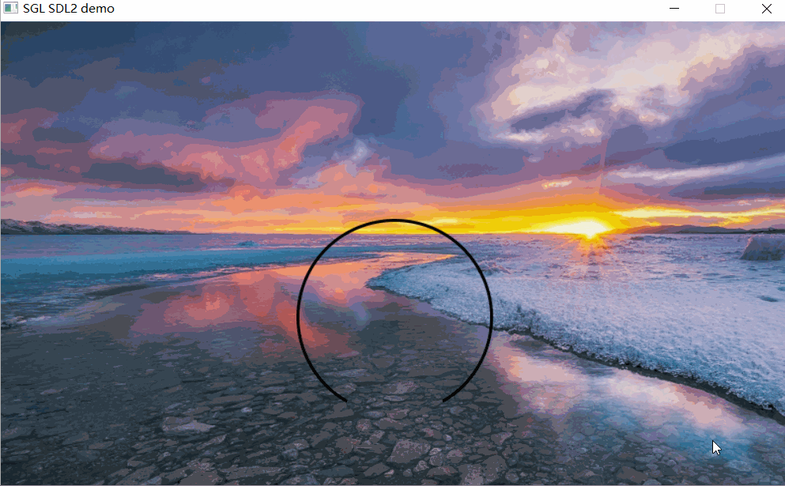
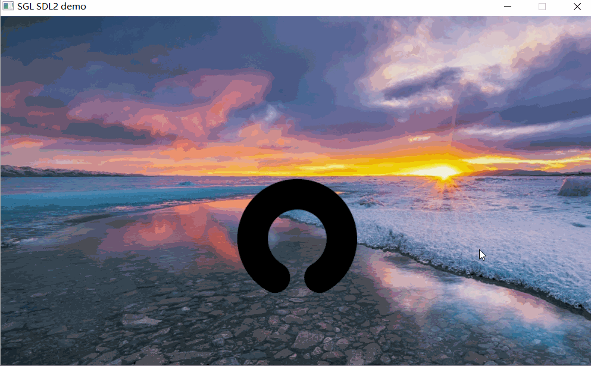
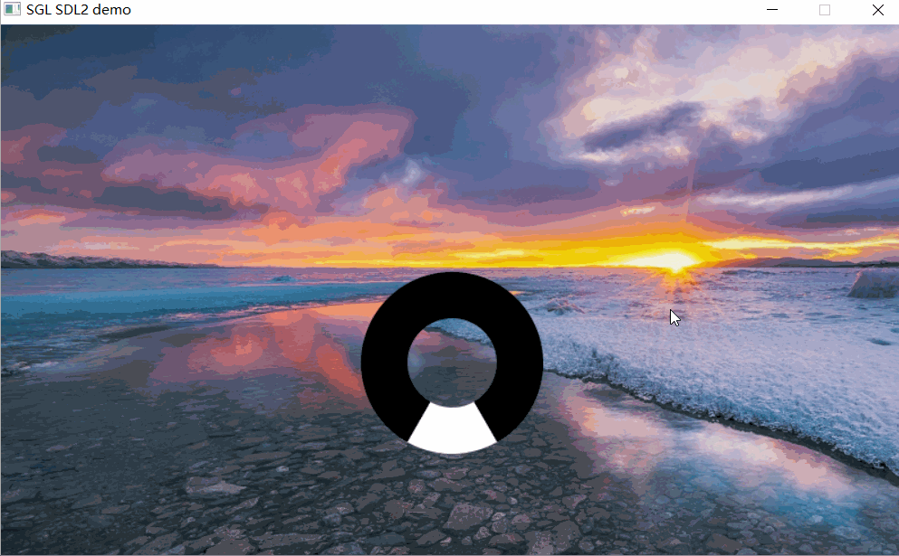
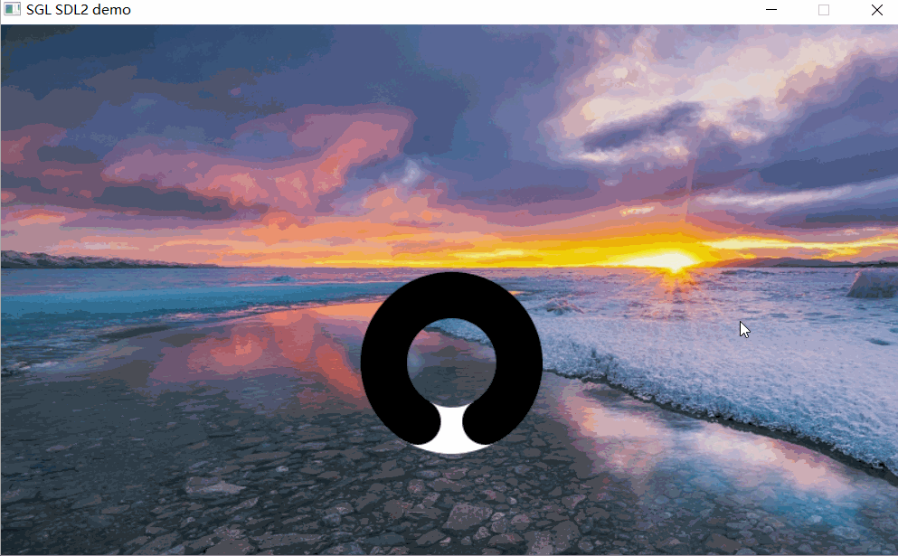
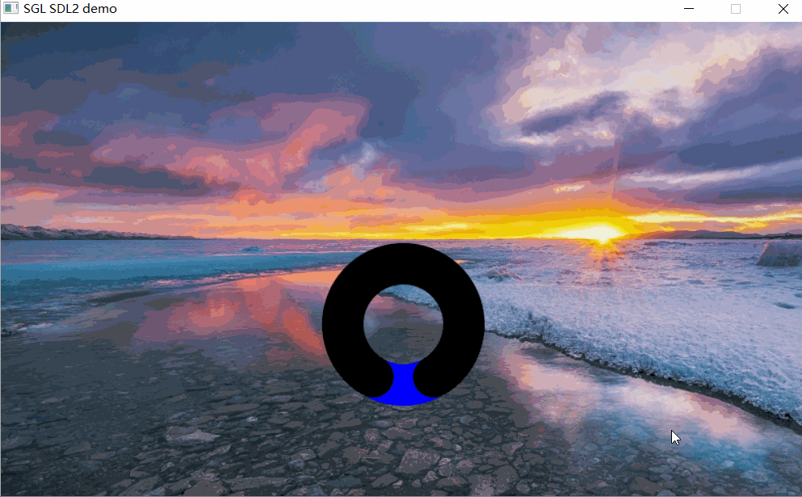

## 创建圆弧
如下代码创建一个圆弧：
```c
int main(void)
{
    ...
    sgl_obj_t *arc = sgl_arc_create(NULL);
    sgl_obj_set_pos(arc, 300, 200);
    sgl_obj_set_size(arc, 200, 200);
    sgl_obj_set_style(arc, SGL_STYLE_RADIUS, 80);
    sgl_obj_set_style(arc, SGL_STYLE_ARC_START_ANGLE, 30);
    sgl_obj_set_style(arc, SGL_STYLE_ARC_END_ANGLE, 330);
    ...

    while(1) {
        sgl_task_handle();
    };
}
```
注意：字体必须设置，否则会进入`ASSERT`    
效果图如下：  


## 设置圆弧的宽度
设置圆弧的宽度，可以通过设置`SGL_STYLE_ARC_WIDTH`属性来设置圆弧的宽度：
```c
int main(void)
{
    ...
    sgl_obj_t *arc = sgl_arc_create(NULL);
    sgl_obj_set_pos(arc, 300, 200);
    sgl_obj_set_size(arc, 200, 200);
    sgl_obj_set_style(arc, SGL_STYLE_RADIUS, 80);
    sgl_obj_set_style(arc, SGL_STYLE_ARC_START_ANGLE, 30);
    sgl_obj_set_style(arc, SGL_STYLE_ARC_END_ANGLE, 330);
    sgl_obj_set_style(arc, SGL_STYLE_ARC_WIDTH, 40);
    ...

    while(1) {
        sgl_task_handle();
    };
}
```
注意：字体必须设置，否则会进入`ASSERT`    
效果图如下：  


## 设置圆弧的圆角
设置圆弧的圆角，可以通过设置`SGL_STYLE_ARC_MODE`属性值为`SGL_DRAW_ARC_NORMAL_SMOOTH`来设置圆弧的圆角：
```c
int main(void)
{
    ...
    sgl_obj_t *arc = sgl_arc_create(NULL);
    sgl_obj_set_pos(arc, 300, 200);
    sgl_obj_set_size(arc, 200, 200);
    sgl_obj_set_style(arc, SGL_STYLE_RADIUS, 80);
    sgl_obj_set_style(arc, SGL_STYLE_ARC_START_ANGLE, 30);
    sgl_obj_set_style(arc, SGL_STYLE_ARC_END_ANGLE, 330);
    sgl_obj_set_style(arc, SGL_STYLE_ARC_WIDTH, 40);
    sgl_obj_set_style(arc, SGL_STYLE_ARC_MODE, SGL_DRAW_ARC_NORMAL_SMOOTH);
    ...

    while(1) {
        sgl_task_handle();
    };
}
```
注意：字体必须设置，否则会进入`ASSERT`    
效果图如下：  



## 设置闭合圆弧
设置闭合圆弧，可以通过设置`SGL_STYLE_ARC_MODE`属性值为`SGL_DRAW_ARC_RING`来设置闭合圆弧：
```c
int main(void)
{
    ...
    sgl_obj_t *arc = sgl_arc_create(NULL);
    sgl_obj_set_pos(arc, 300, 200);
    sgl_obj_set_size(arc, 200, 200);
    sgl_obj_set_style(arc, SGL_STYLE_RADIUS, 80);
    sgl_obj_set_style(arc, SGL_STYLE_ARC_START_ANGLE, 30);
    sgl_obj_set_style(arc, SGL_STYLE_ARC_END_ANGLE, 330);
    sgl_obj_set_style(arc, SGL_STYLE_ARC_WIDTH, 40);
    sgl_obj_set_style(arc, SGL_STYLE_ARC_MODE, SGL_DRAW_ARC_RING);
    ...

    while(1) {
        sgl_task_handle();
    };
}
```
注意：字体必须设置，否则会进入`ASSERT`    
效果图如下：  


## 设置闭合圆弧的圆角
设置闭合圆弧的圆角，可以通过设置`SGL_STYLE_ARC_MODE`属性值为`SGL_DRAW_ARC_RING_SMOOTH`来设置闭合圆弧的圆角：
```c
int main(void)
{
    ...
    sgl_obj_t *arc = sgl_arc_create(NULL);
    sgl_obj_set_pos(arc, 300, 200);
    sgl_obj_set_size(arc, 200, 200);
    sgl_obj_set_style(arc, SGL_STYLE_RADIUS, 80);
    sgl_obj_set_style(arc, SGL_STYLE_ARC_START_ANGLE, 30);
    sgl_obj_set_style(arc, SGL_STYLE_ARC_END_ANGLE, 330);
    sgl_obj_set_style(arc, SGL_STYLE_ARC_WIDTH, 40);
    sgl_obj_set_style(arc, SGL_STYLE_ARC_MODE, SGL_DRAW_ARC_RING_SMOOTH);
    ...

    while(1) {
        sgl_task_handle();
    };
}
```
注意：字体必须设置，否则会进入`ASSERT`    
效果图如下：  


## 设置圆弧的背景颜色
设置圆弧的背景颜色，可以通过设置`SGL_STYLE_BG_COLOR`属性来设置圆弧的背景颜色：
```c
int main(void)
{
    ...
    sgl_obj_t *arc = sgl_arc_create(NULL);
    sgl_obj_set_pos(arc, 300, 200);
    sgl_obj_set_size(arc, 200, 200);
    sgl_obj_set_style(arc, SGL_STYLE_RADIUS, 80);
    sgl_obj_set_style(arc, SGL_STYLE_ARC_START_ANGLE, 30);
    sgl_obj_set_style(arc, SGL_STYLE_ARC_END_ANGLE, 330);
    sgl_obj_set_style(arc, SGL_STYLE_ARC_WIDTH, 40);
    sgl_obj_set_style(arc, SGL_STYLE_ARC_MODE, SGL_DRAW_ARC_RING_SMOOTH);
    sgl_obj_set_style(arc, SGL_STYLE_BG_COLOR, SGL_COLOR(SGL_BLUE));
    ...

    while(1) {
        sgl_task_handle();
    };
}
```
注意：字体必须设置，否则会进入`ASSERT`    
效果图如下：  


