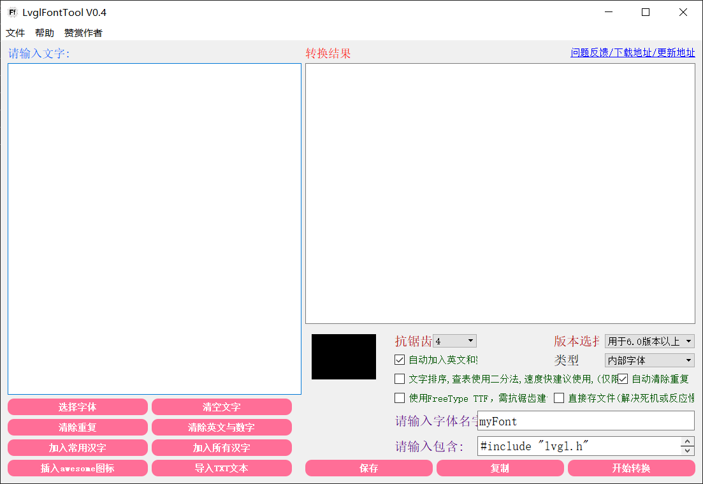
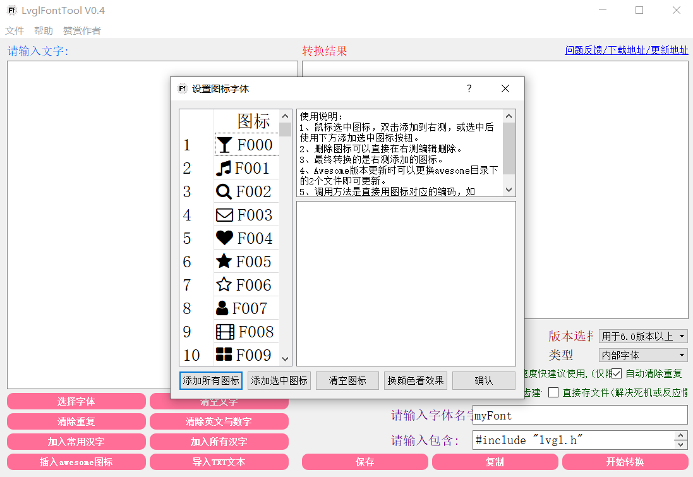
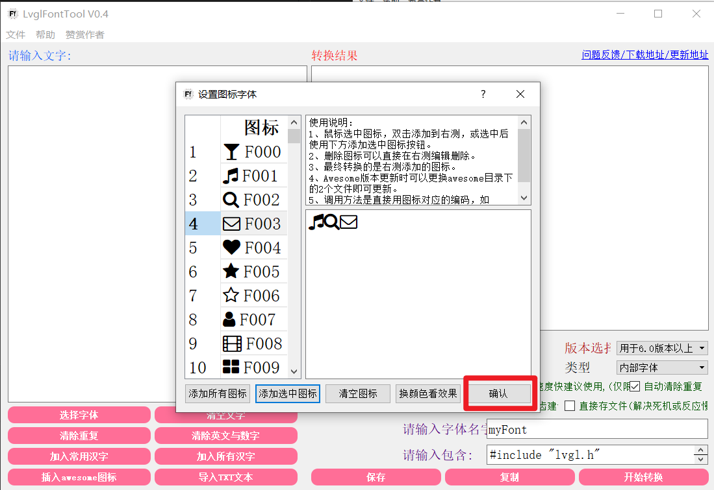
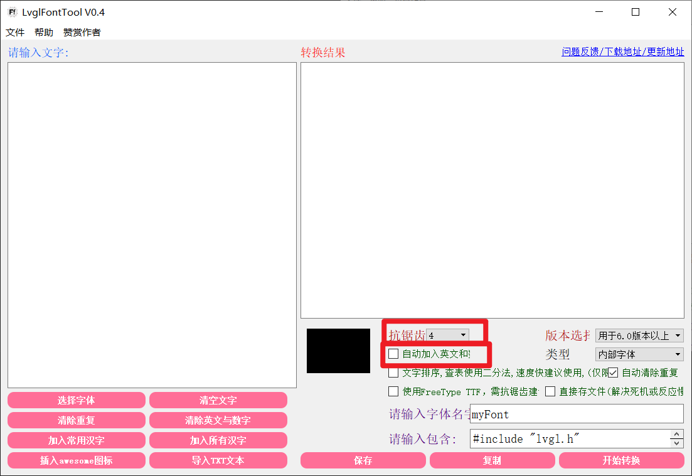

# ICON取模
目前SGL仅支持`LvglFontTool`工具中的awesome font图标，如果需要其他图标，需要等后序工具。

## 1. 打开LvglFontTool工具
    

## 2. 选择【插入awesome图标】
  

## 3. 点击需要的图标
  

## 4. 点击击【确认】
  

## 5. 设置取模参数
选择【抗锯齿4】，取消【自动加入英文】，然后点击【开始转换】
  
转换后，会得到字模数据，如下所示：
```c
0x00,0x00,0x00,0x00,0x00,0x00,0x05,0x30,  //.............+.
0x00,0x00,0x00,0x00,0x03,0x8e,0xff,0xc0,  //..........+@@@%
0x00,0x00,0x00,0x3a,0xef,0xff,0xff,0xc0,  //.......%@@@@@@%
0x00,0x00,0x5e,0xff,0xff,0xff,0xff,0xc0,  //....+@@@@@@@@@%
0x00,0x00,0x8e,0xff,0xff,0xff,0xff,0xc0,  //....+@@@@@@@@@%
0x00,0x00,0x8e,0xff,0xff,0xff,0xee,0xc0,  //....+@@@@@@@@@%
0x00,0x00,0x8e,0xff,0xfe,0xa3,0x0e,0xc0,  //....+@@@@@%..@%
0x00,0x00,0x8e,0xe8,0x30,0x00,0x0e,0xc0,  //....+@@+.....@%
0x00,0x00,0x8c,0x50,0x00,0x00,0x0e,0xc0,  //....+%+......@%
0x00,0x00,0x8c,0x50,0x00,0x00,0x0e,0xc0,  //....+%+......@%
0x00,0x00,0x8c,0x50,0x03,0xaa,0xae,0xc0,  //....+%+...%%%@%
0x00,0x00,0x8c,0x50,0xaf,0xff,0xff,0xc0,  //....+%+.%@@@@@%
0x00,0x33,0x8c,0x50,0xcf,0xff,0xff,0xc0,  //....+%+.%@@@@@%
0xae,0xff,0xfe,0x50,0x3a,0xef,0xec,0x30,  //%@@@@@+..%@@@%.
0xef,0xff,0xfe,0x50,0x00,0x00,0x00,0x00,  //@@@@@@+........
0xcf,0xff,0xfc,0x00,0x00,0x00,0x00,0x00,  //%@@@@%.........


/*  */
0x00,0x00,0x03,0x65,0x30,0x00,0x00,0x00,  //......++........
0x00,0x3c,0xef,0xff,0xfc,0x50,0x00,0x00,  //...%@@@@@%+.....
0x05,0xef,0xff,0xff,0xff,0xea,0x00,0x00,  //.+@@@@@@@@@%....
0x3e,0xff,0xc5,0x03,0xae,0xfe,0x80,0x00,  //.@@@%+..%@@@+...
0xaf,0xfc,0x00,0x00,0x08,0xef,0xe0,0x00,  //%@@%.....+@@@...
0xef,0xe3,0x00,0x00,0x00,0xcf,0xe8,0x00,  //@@@.......%@@+..
0xef,0xc0,0x00,0x00,0x00,0x8e,0xfa,0x00,  //@@%.......+@@%..
0xef,0xc0,0x00,0x00,0x00,0x5e,0xfa,0x00,  //@@%.......+@@%..
0xef,0xc0,0x00,0x00,0x00,0x8e,0xfa,0x00,  //@@%.......+@@%..
0xef,0xe5,0x00,0x00,0x00,0xef,0xe5,0x00,  //@@@+......@@@+..
0x8e,0xfe,0x30,0x00,0x0c,0xff,0xc0,0x00,  //+@@@.....%@@%...
0x0c,0xff,0xec,0x6a,0xef,0xff,0xc0,0x00,  //.%@@@%+%@@@@%...
0x00,0xcf,0xff,0xff,0xff,0xff,0xfc,0x00,  //..%@@@@@@@@@@%..
0x00,0x05,0xce,0xff,0xc8,0x3e,0xff,0xc0,  //...+%@@@%+.@@@%.
0x00,0x00,0x00,0x00,0x00,0x03,0xef,0xfc,  //............@@@%
0x00,0x00,0x00,0x00,0x00,0x00,0x3e,0xfe,  //.............@@@


/*  */
0x03,0x33,0x33,0x33,0x33,0x33,0x33,0x33,0x00,  //.................
0xef,0xff,0xff,0xff,0xff,0xff,0xff,0xff,0xe0,  //@@@@@@@@@@@@@@@@@
0xc8,0x00,0x00,0x00,0x00,0x00,0x00,0x08,0xc0,  //%+.............+%
0xea,0x00,0x00,0x00,0x00,0x00,0x00,0x0a,0xe0,  //@%.............%@
0xee,0x50,0x00,0x00,0x00,0x00,0x00,0x5e,0xe0,  //@@+...........+@@
0xce,0xe8,0x00,0x00,0x00,0x00,0x08,0xee,0xc0,  //%@@+.........+@@%
0xc8,0xce,0xa0,0x00,0x00,0x00,0xae,0xc8,0xc0,  //%+%@%.......%@%+%
0xc8,0x08,0xec,0x30,0x00,0x3c,0xe8,0x08,0xc0,  //%+.+@%.....%@+.+%
0xc8,0x00,0x5e,0xe5,0x05,0xee,0x50,0x08,0xc0,  //%+..+@@+.+@@+..+%
0xc8,0x00,0x03,0xee,0xce,0xe3,0x00,0x08,0xc0,  //%+....@@%@@....+%
0xc8,0x00,0x00,0x05,0x85,0x00,0x00,0x08,0xc0,  //%+.....+++.....+%
0xc8,0x00,0x00,0x00,0x00,0x00,0x00,0x08,0xc0,  //%+.............+%
0xc8,0x00,0x00,0x00,0x00,0x00,0x00,0x08,0xc0,  //%+.............+%
0xef,0xff,0xff,0xff,0xff,0xff,0xff,0xff,0xe0,  //@@@@@@@@@@@@@@@@@
0x03,0x33,0x33,0x33,0x33,0x33,0x33,0x33,0x00,  //.................
```
## 6. 创建sgl_icon_pixmap_t结构体

```c
static const uint8_t music_icon_pixmap[] = {
0x00,0x00,0x00,0x00,0x00,0x00,0x05,0x30,  //.............+.
0x00,0x00,0x00,0x00,0x03,0x8e,0xff,0xc0,  //..........+@@@%
0x00,0x00,0x00,0x3a,0xef,0xff,0xff,0xc0,  //.......%@@@@@@%
0x00,0x00,0x5e,0xff,0xff,0xff,0xff,0xc0,  //....+@@@@@@@@@%
0x00,0x00,0x8e,0xff,0xff,0xff,0xff,0xc0,  //....+@@@@@@@@@%
0x00,0x00,0x8e,0xff,0xff,0xff,0xee,0xc0,  //....+@@@@@@@@@%
0x00,0x00,0x8e,0xff,0xfe,0xa3,0x0e,0xc0,  //....+@@@@@%..@%
0x00,0x00,0x8e,0xe8,0x30,0x00,0x0e,0xc0,  //....+@@+.....@%
0x00,0x00,0x8c,0x50,0x00,0x00,0x0e,0xc0,  //....+%+......@%
0x00,0x00,0x8c,0x50,0x00,0x00,0x0e,0xc0,  //....+%+......@%
0x00,0x00,0x8c,0x50,0x03,0xaa,0xae,0xc0,  //....+%+...%%%@%
0x00,0x00,0x8c,0x50,0xaf,0xff,0xff,0xc0,  //....+%+.%@@@@@%
0x00,0x33,0x8c,0x50,0xcf,0xff,0xff,0xc0,  //....+%+.%@@@@@%
0xae,0xff,0xfe,0x50,0x3a,0xef,0xec,0x30,  //%@@@@@+..%@@@%.
0xef,0xff,0xfe,0x50,0x00,0x00,0x00,0x00,  //@@@@@@+........
0xcf,0xff,0xfc,0x00,0x00,0x00,0x00,0x00,  //%@@@@%.........
};

static sgl_icon_pixmap_t music_icon = {
    .bitmap = music_icon_pixmap,
    .bpp = 4,
    .height = 15,
    .width = 16,
};
```
其中`bpp`为图标的像素点位数，`height`为图标的高度，`width`为图标的宽度，`bitmap`为图标的像素点数据。
`height`的值是上面数组中的行数，`width`的值是数组中列数*2。

##  7. 使用图标
如下所示：
```c
sgl_obj_set_style(button, SGL_STYLE_ICON, SGL_ICON(music_icon));
```
