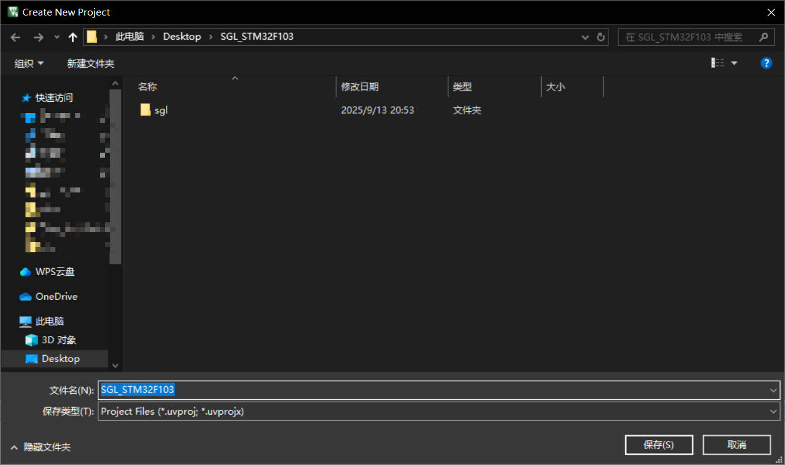
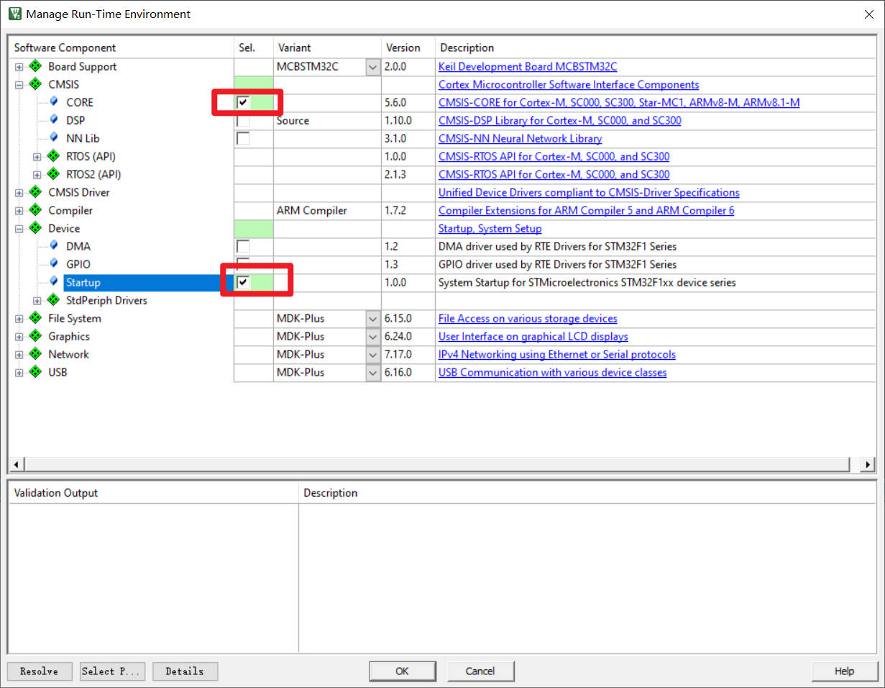
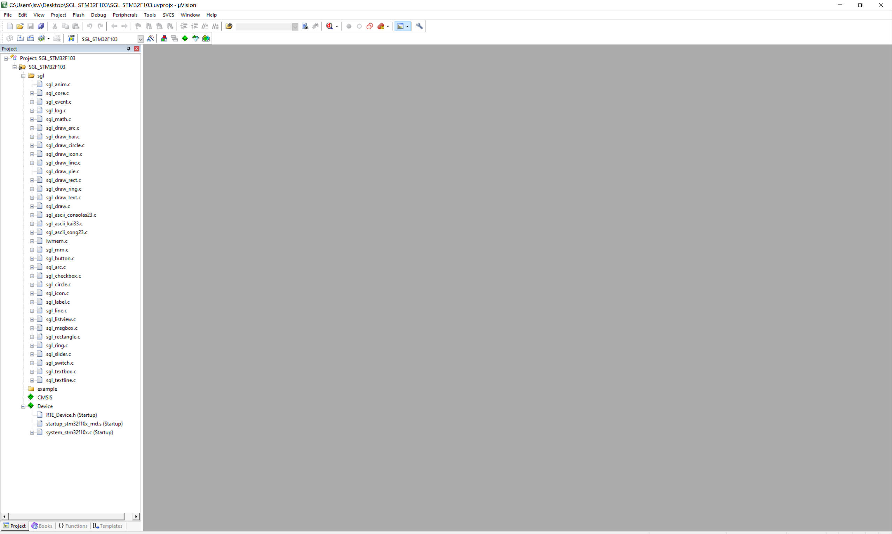
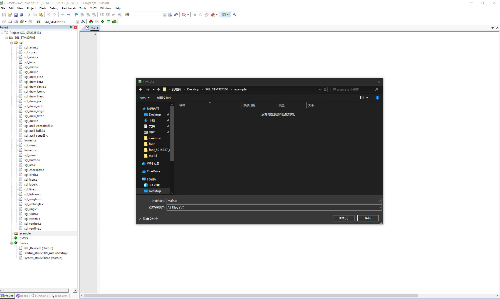
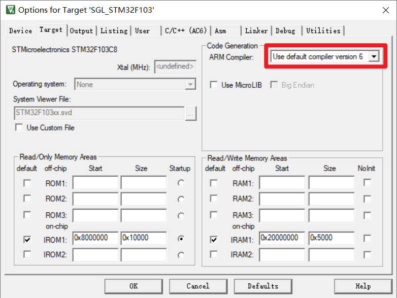

# MDK5移植SGL
## 1. 创建工程
1. 新建一个`SGL_STM32F103`目录，然后创建一个`sgl`目录，然后将`sgl`源码的`source`目录下的所有文件复制到`SGL_STM32F103/sgl/`目录下。      
    

2. 打开`MDK5`软件，新建一个名为`SGL_STM32F103`的工程，保存到`SGL_STM32F103`目录下，点击【保存】。      
    


3. 此时会进入芯片选择界面，然后选择STM32F103C8芯片，点击【OK】      
    

4. 此时会进入`Manage Run-Time Environment`界面，勾选`CMSIS`和`Startup`，然后点击【OK】。       
    

5. 点击文件扩展管理器:      
    

    然后新建`sgl`和`example`目录结构，然后在`sgl`结构中，将`sgl/core/`目录下所有c文件添加，将`sgl/draw/`目录下所有c文件添加，将`sgl/fonts/`目录下所有c文件添加，将`sgl/source/mm/lwmem/`目录下的所有c文件添加，将`sgl/source/widgets/`目录下的所有文件添加，添加完毕后，目录结构如下：           
    

6. 新建一个`main.c`文件，然后保存到`example`文件夹下：            
    

    然后输入如下代码：          
    ```c
    #include "stm32f10x.h"
    #include "sgl.h"


    #define  PANEL_WIDTH    240
    #define  PANEL_HEIGHT   240
    sgl_color_t panel_buffer[PANEL_WIDTH * 1];


    void demo_panel_flush_area(int16_t x, int16_t y, int16_t w, int16_t h, sgl_color_t *src)
    {
        /* set flush windows address */
        //tft_set_win(x, y, x + w - 1, y + h - 1);
            
            //SPI1_WriteMultByte((uint8_t*)src, w * h * 2);
    }

    void UART1_SendString(const char *str)
        {
        while (*str != '\0') {
            while ((USART1->SR & USART_SR_TXE) == 0);
            USART1->DR = (uint8_t)(*str++);
        }
        while ((USART1->SR & USART_SR_TC) == 0);
    }

    int main(void)
    {
        sgl_device_fb_t fb_dev = {
            .xres = PANEL_WIDTH,
            .yres = PANEL_HEIGHT,
            .xres_virtual = PANEL_WIDTH,
            .yres_virtual = PANEL_HEIGHT,
            .flush_area = demo_panel_flush_area,
            .framebuffer = panel_buffer,
            .framebuffer_size = SGL_ARRAY_SIZE(panel_buffer),
        };

        sgl_device_fb_register(&fb_dev);
        sgl_device_log_register(UART1_SendString);

        //USART1_GPIO_Config();
        //USART1_Config();

        /* init sgl */
        sgl_init();

        while(1) {
            sgl_task_handle();
        }
        
        return 0;
    }
    ```

7. 编辑`sgl_config.h`文件，修改内容如下：
    ```c
    #define    CONFIG_SGL_PANEL_PIXEL_DEPTH       16
    #define    CONFIG_SGL_EVENT_QUEUE_SIZE        16
    #define    CONFIG_SGL_DEBUG                   0
    #define    CONFIG_SGL_LOG_COLOR               1
    #define    CONFIG_SGL_LOG_LEVEL               0
    #define    CONFIG_SGL_FONT                    1
    #define    CONFIG_SGL_USE_OBJ_ID              0
    #define    CONFIG_SGL_USE_STYLE_UNIFIED_API   1
    #define    CONFIG_SGL_HEAP_ALGO               lwmem
    #define    CONFIG_SGL_FL_INDEX_MAX            20
    #define    CONFIG_SGL_HEAP_MEMORY_SIZE        10240
    #define    CONFIG_SGL_FONT_SONG23             1
    #define    CONFIG_SGL_FONT_CONSOLAS23         0
    #define    CONFIG_SGL_FONT_KAI33              0
    #define    CONFIG_SGL_THEME_DEFAULT           1    
    ```
## 配置编译选项
1. 打开`Options for Target`窗口，然后找到`Target`选项:             
    

    选择`V6`版本编译器
2. 点击`C/C++(AC6)`选项`，然后选择如下配置：              
    

   然后添加头文件路径，将`sgl/include`添加到`Include Path`中，将`sgl`目录添加到`Include Path`中。                   
    

## 创建一个简单的demo
在`main.c`中添加如下代码：
```c
int main(void)
{
    ...
    sgl_init();
    ...

    /* 添加一个按钮 */
    sgl_obj_t *button = sgl_button_create(NULL);
    sgl_obj_set_pos(button, 20, 20);
    sgl_obj_set_size(button, 200, 100);
    sgl_obj_set_style(button, SGL_STYLE_RADIUS, 50);
    sgl_obj_set_style(button, SGL_STYLE_BORDER_WIDTH, 2);
    sgl_obj_set_style(button, SGL_STYLE_BORDER_COLOR, SGL_COLOR(SGL_BLACK));

    while(1) {
        sgl_task_handle();
    }

    return 0;
}
```
然后点击编译按钮，编译成功后，烧录到开发板中即可。    

