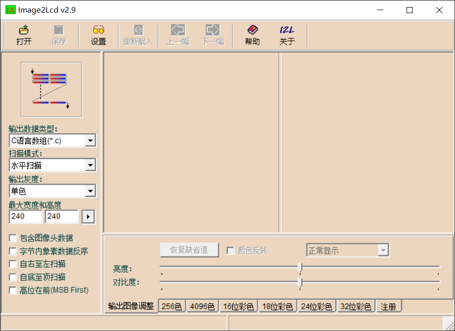
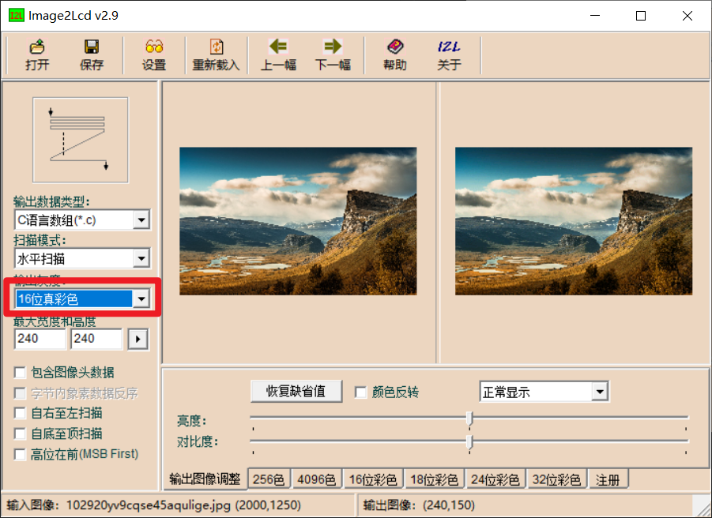
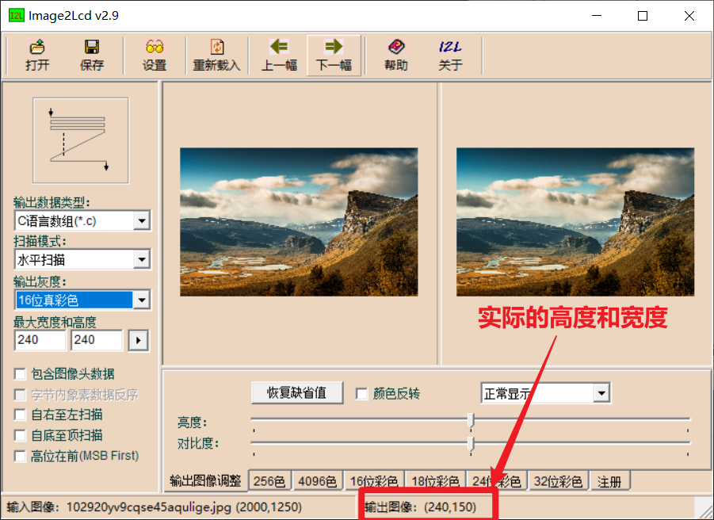

# SGL图片取模
SGL的图片取模和其他GUI库一样，都是将图片的像素点进行取模，然后将像素点进行转换成颜色值，然后将颜色值进行存储，这样图片的像素点就可以被快速访问了。具体步骤如下：

## 1. 打开Image2Lcd-2.9软件   
    

## 2. 选择图片
点击【打开】按钮，选择需要取模的图片    
     
选择【水平扫描】，【16位真彩色】，然后输入最大宽度和高度，然后点击最大高度和宽度右边的“右箭头”，此时取模完成，然后点击【保存】按钮，保存为`.c`文件。

## 3. 创建sgl_pixmap_t结构体
在你的源码文件中添加如下代码：   
```c
extern const unsigned char gImage_test[1440000];
const sgl_pixmap_t test_pixmap = {
    .width = 240,
    .height = 150,
    .bitmap = gImage_test,
};
```
其中`width`是取模后实际的宽度，`height`是取模后实际的高度，实际的宽度和高度在取模软件的右下角可以查看，如下所示：     
    

### 4. 使用图片
在需要使用的地方添加如下代码：
```c
sgl_obj_set_pixmap(button, &test_pixmap);
```
