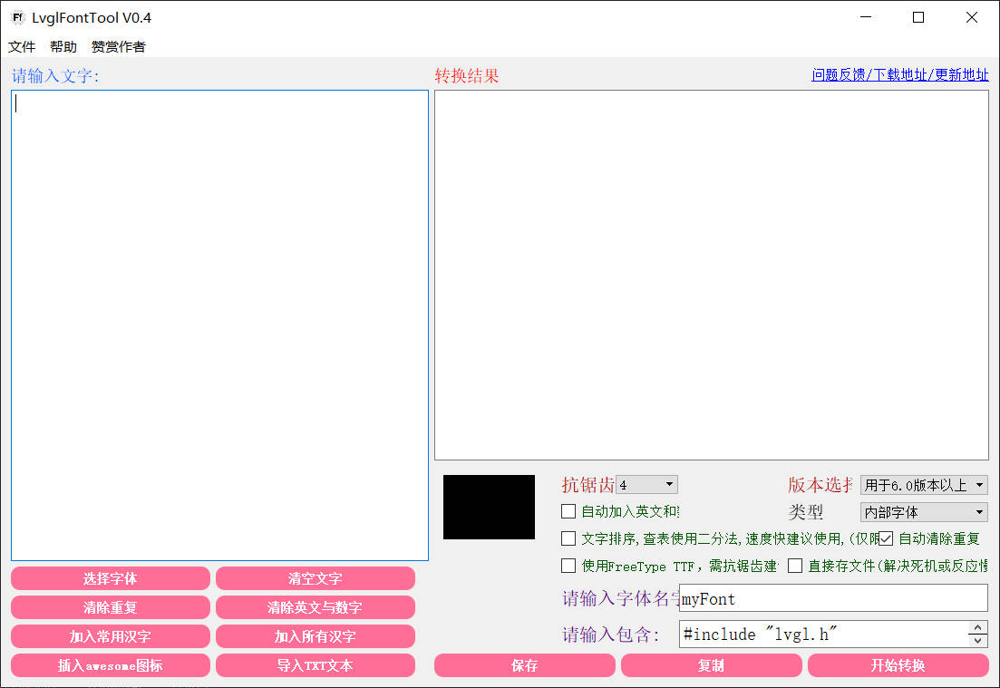
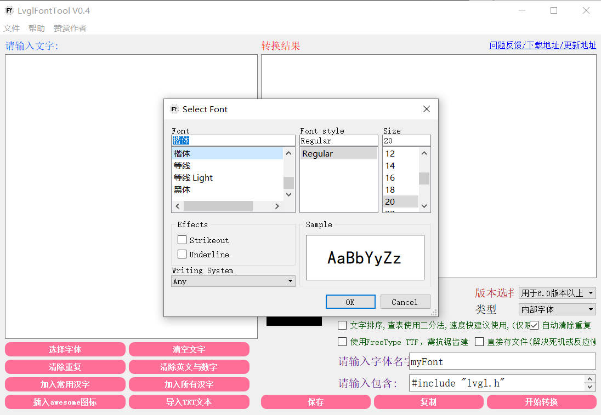
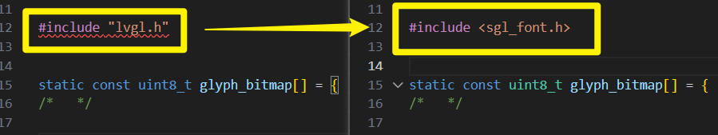
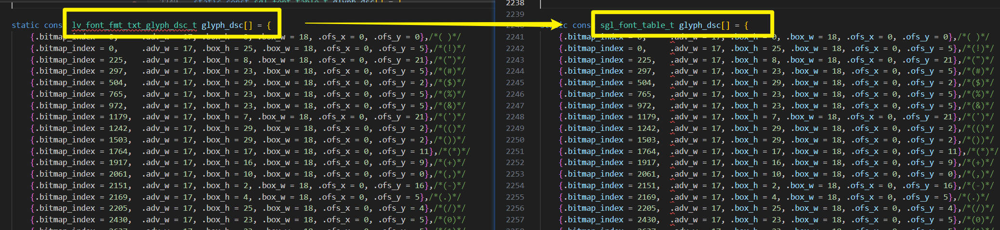

## 新建字体
目前仅支持tools目录下的字体取模工具`LvglFontTool`，具体步骤如下：
### 步骤
#### 1. 运行LvglFontTool



#### 2. 选择字体
这里以楷体20号为例子：   


#### 3. 勾选自动加入英文


#### 4. 点击转换


#### 5. 保存为.c文件
将转换后的字体保存为`sgl_ascii_kai33.c`。   


#### 6. 修改字体文件
将`sgl_ascii_kai33.c`文件放到源码目录的`fonts`文件夹下，打开`sgl_ascii_kai33.c`文件，做如下修改：   
1. 将"lvgl.h"改为<sgl_font.h>     


2. 仅保留`glyph_bitmap`和`glyph_dsc`内容和`unicode_list_1`，其他均删除掉，并将`glyph_dsc`类型修改为`sgl_font_table_t`，如下所示：   

3. 将`glyph_dsc`内容的`adv_w`全部删除，如下所示：   


4. 添加`sgl_font_t`结构体，将下面的字体结构体模板复制到`sgl_ascii_kai33.c`文件末尾，然后填充相应的字段即可。
    ```c
    sgl_font_t xxx_font = {
        .bitmap = sgl_ascii_xxxx_bitmap,
        .table = sgl_ascii_xxx_tab,
        .font_height = xx,
        .bpp = xx,
    #ifdef SGL_CONFIG_TEXT_UTF8
        .unicode_list = unicode_list_1,
        .unicode_list_len = sizeof(unicode_list_1) / sizeof(unicode_list_1[0])
    #endif        
    };
    ```
    由于我们的字体是`kai33`号字体，所以我们的`sgl_font_t`结构体为下面这样：
    ```c
    sgl_font_t kai33 = {
        .bitmap = glyph_bitmap,
        .table = glyph_dsc,
        .font_height = 33,
        .bpp = 4,
    #ifdef SGL_CONFIG_TEXT_UTF8
        .unicode_list = unicode_list_1,
        .unicode_list_len = sizeof(unicode_list_1) / sizeof(unicode_list_1[0])
    #endif        
    };
    ```
#### 7. 添加字体申明
在`sgl_font.h`文件中添加字体的声明：   
   
然后就可以使用这个字体了
