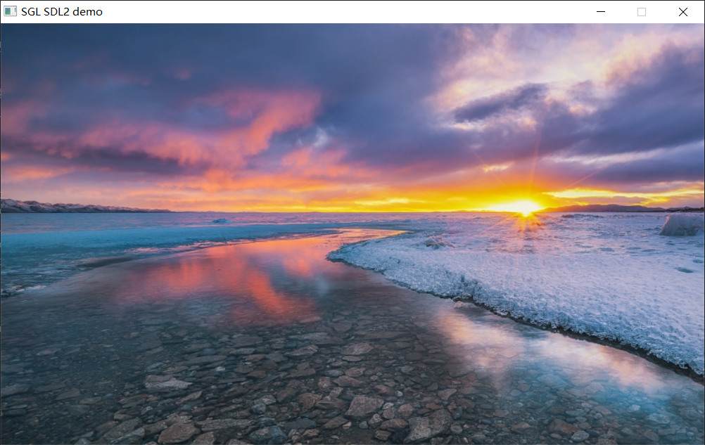

## Setting Desktop Background
Use `sgl_obj_set_pixmap(sgl_screen_act(), &bg_pixmap)` or `sgl_obj_set_style(button, SGL_STYLE_PIXMAP, SGL_PIXMAP(bg_pixmap))` function to set the page background image, for example:
```c
void button_event_cb(sgl_event_t *evt)
{
    size_t para = evt->param;
    switch (evt->type) {
        case SGL_EVENT_PRESSED:
            printf("Button %d pressed\n", para);
            break;
        case SGL_EVENT_RELEASED:
            printf("Button %d released\n", para);
            break; 
    }
}

extern const unsigned char bg_gImage[1440000];
sgl_pixmap_t bg_pixmap = {
    .width = 800,
    .height = 480,
    .bitmap = bg_gImage,
};


int main(void)
{
    sgl_device_fb_register(&fb_dev);
    sgl_device_log_register(uart_put_string);
    /* Initialize SGL library */
    sgl_init();
    /* Set desktop background image */
    sgl_obj_set_pixmap(sgl_screen_act(), &bg_pixmap);
    /*
    Or use the following function to set the desktop background image:
    sgl_obj_set_style(sgl_screen_act(), SGL_STYLE_PIXMAP, SGL_PIXMAP(bg_pixmap));
    */
    ...

    while(1) {
        sgl_task_handle();
    };
}

```



## Drawing Rectangles
Drawing rectangles can use the [sgl_rect_create](file://c:\Users\lsw\Desktop\sgl\source\widgets\rectangle\sgl_rectangle.h#L53-L53) function to create a rectangle, the code is as follows:
```c
sgl_obj_t *rect = sgl_rect_create(NULL);
sgl_obj_set_pos(rect, 20, 20);
sgl_obj_set_size(rect, 200, 100);
```

note:
You can use `sgl_obj_set_style(rect, SGL_STYLE_RADIUS, 10);` to set the rectangle's rounded corners, the parameter is the corner radius.
```c
sgl_obj_t *rect = sgl_rect_create(NULL);
sgl_obj_set_pos(rect, 20, 20);
sgl_obj_set_size(rect, 200, 100);
sgl_obj_set_style(rect, SGL_STYLE_RADIUS, 10);
```

## Drawing Circles
You can use the `sgl_circle_create()` function to create a circle, the parameter is the parent widget pointer, for example, the following code:
```c
sgl_obj_t *circle = sgl_circle_create(NULL);
sgl_obj_set_pos(circle, 100, 100);
sgl_obj_set_size(circle, 100, 100);
sgl_obj_set_style(circle, SGL_STYLE_RADIUS, 50);
```


## Drawing Rings
You can use the [sgl_ring_create()](file://c:\Users\lsw\Desktop\sgl\source\widgets\arc\sgl_ring.h#L41-L41) function to create a ring, the parameter is the parent widget pointer, for example, the following code:
```c
sgl_obj_t *ring = sgl_ring_create(NULL);
sgl_obj_set_pos(ring, 100, 100);
sgl_obj_set_size(ring, 101, 101);
sgl_obj_set_style(ring, SGL_STYLE_RADIUS, 50);
sgl_obj_set_style(ring, SGL_STYLE_RING_WIDTH, 5);
```

## Drawing Lines
You can use the `sgl_line_create()` function to create a line, the parameter is the parent widget pointer, for example, the following code:
```c
sgl_obj_t *line = sgl_line_create(NULL);
sgl_obj_set_pos(line, 100, 100);
sgl_obj_set_size(line, 200, 0);
sgl_obj_set_style(line, SGL_STYLE_LINE_WIDTH, 5);
```
Note: Drawing lines may have issues, such as setting width being invalid. Currently, only horizontal and vertical line drawing is supported. Do not use diagonal line drawing.
