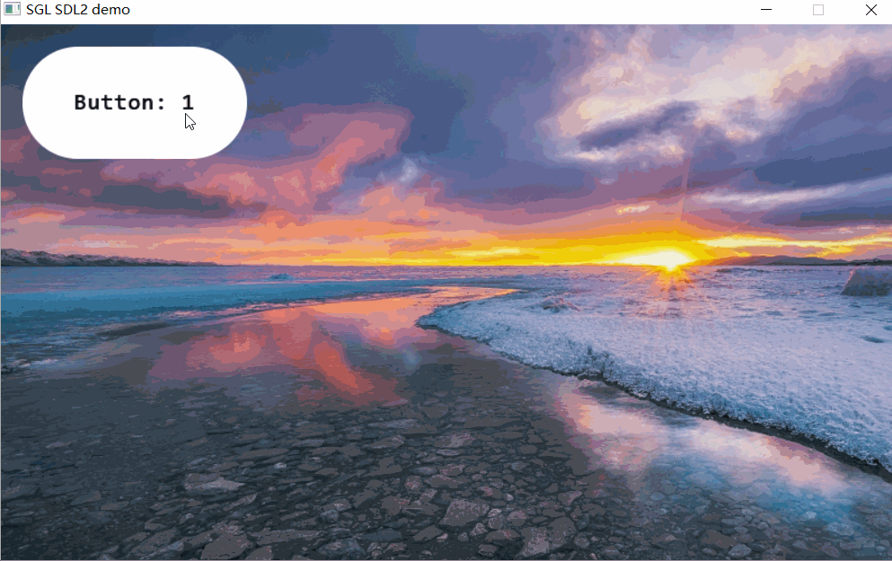
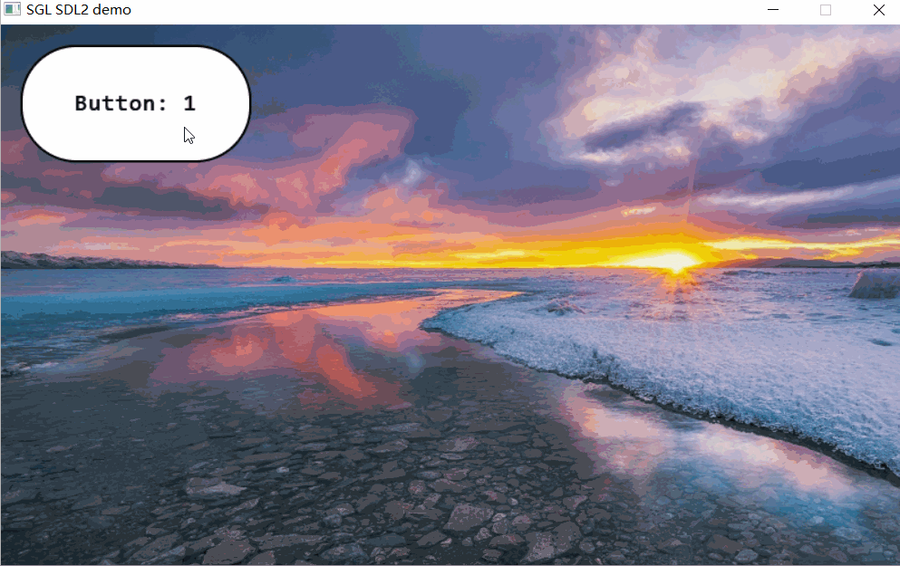
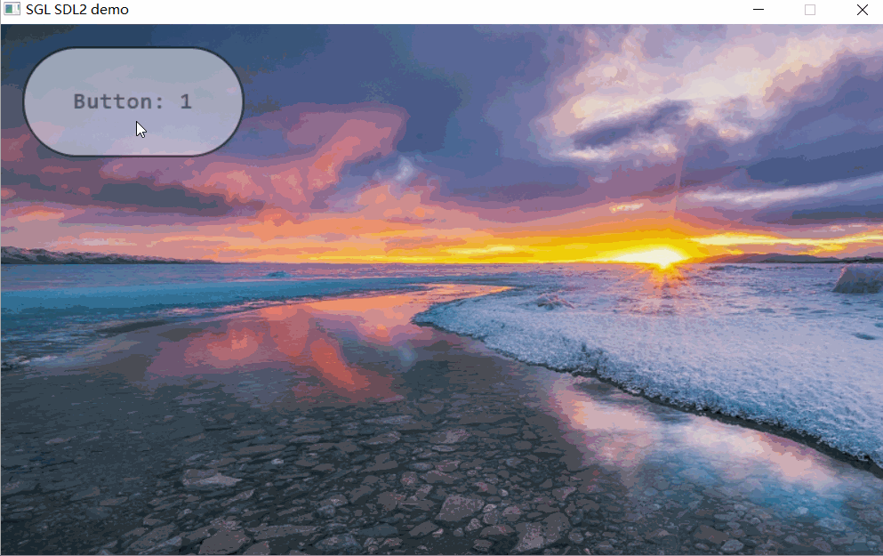

## Creating Buttons
Create a button as follows:
```c
int main(void)
{
    ...
    sgl_obj_t *button = sgl_button_create(NULL);
    sgl_obj_set_pos(button, 20, 20);
    sgl_obj_set_size(button, 200, 100);
    ...

    while(1) {
        sgl_task_handle();
    };
}
```
The effect is as follows:  


Methods for setting button colors are referenced as follows:
```c
sgl_obj_set_style(button, SGL_STYLE_COLOR, SGL_COLOR(SGL_BLUE));
sgl_obj_set_style(button, SGL_STYLE_BORDER_COLOR, SGL_COLOR(SGL_BLACK));
sgl_obj_set_style(button, SGL_STYLE_TEXT_COLOR, SGL_COLOR(SGL_GREEN));
```

## Setting Button Text
Setting button text can directly use `sgl_obj_set_style`, or create a label widget and then make the label widget a child of the button.
### Using SGL_STYLE_TEXT style to set text
```c
int main(void)
{
    ...
    sgl_obj_t *button = sgl_button_create(NULL);
    sgl_obj_set_pos(button, 20, 20);
    sgl_obj_set_size(button, 200, 100);
    sgl_obj_set_font(button, &consolas23);
    sgl_obj_set_style(button, SGL_STYLE_TEXT, SGL_TEXT("Button: 1"));
    ...

    while(1) {
        sgl_task_handle();
    };
}

```
Note: Before using the `sgl_obj_set_style` function, you must set the style and the style must have a font, otherwise an error will occur.
The effect is as follows:  


### Using label widget to set text
The `label` widget is used to display text. Use the following code to create a `label` widget:
```c
int main(void)
{
    ...
    sgl_obj_t *button = sgl_button_create(NULL);
    sgl_obj_set_pos(button, 20, 20);
    sgl_obj_set_size(button, 200, 100);

    sgl_obj_t *label = sgl_label_create(button);
    sgl_obj_set_font(label, &consolas23);
    sgl_obj_set_style(label, SGL_STYLE_TEXT, SGL_TEXT("Button: 1"));
    ...

    while(1) {
        sgl_task_handle();
    };
}
```
The effect is as follows:   


## Rounded Buttons
To create a rounded button, you need to set the `SGL_STYLE_RADIUS` property in the style sheet, as shown below:
```c
int main(void)
{
    ...
    sgl_obj_t *button = sgl_button_create(NULL);
    sgl_obj_set_pos(button, 20, 20);
    sgl_obj_set_size(button, 200, 100);
    sgl_obj_set_style(button, SGL_STYLE_RADIUS, 50);
    sgl_obj_set_font(button, &consolas23);
    sgl_obj_set_style(button, SGL_STYLE_TEXT, SGL_TEXT("Button: 1"));
    ...

    while(1) {
        sgl_task_handle();
    };
}
```
The effect is as follows:   


## Buttons with Borders
To create buttons with borders, simply add `SGL_STYLE_BORDER_COLOR` and `SGL_STYLE_BORDER_WIDTH` to `style_prop`, for example:
```c
int main(void)
{
    ...
    sgl_obj_t *button = sgl_button_create(NULL);
    sgl_obj_set_pos(button, 20, 20);
    sgl_obj_set_size(button, 200, 100);
    sgl_obj_set_style(button, SGL_STYLE_RADIUS, 50);
    sgl_obj_set_style(button, SGL_STYLE_BORDER_WIDTH, 2);
    sgl_obj_set_style(button, SGL_STYLE_BORDER_COLOR, SGL_COLOR(SGL_BLACK));
    sgl_obj_set_font(button, &consolas23);
    sgl_obj_set_style(button, SGL_STYLE_TEXT ,SGL_TEXT("Button: 1"));
    ...

    while(1) {
        sgl_task_handle();
    };
}
```
The result is as follows:   


## Transparent Buttons
To create transparent buttons, simply set `SGL_STYLE_ALPHA` to the transparency you need, for example:
```c
int main(void)
{
    ...
    sgl_obj_t *button = sgl_button_create(NULL);
    sgl_obj_set_pos(button, 20, 20);
    sgl_obj_set_size(button, 200, 100);
    sgl_obj_set_style(button, SGL_STYLE_RADIUS, 50);
    sgl_obj_set_style(button, SGL_STYLE_BORDER_WIDTH, 2);
    sgl_obj_set_style(button, SGL_STYLE_BORDER_COLOR, SGL_COLOR(SGL_BLACK));
    sgl_obj_set_style(button, SGL_STYLE_ALPHA, 128);
    sgl_obj_set_font(button, &consolas23);
    sgl_obj_set_style(button, SGL_STYLE_TEXT ,SGL_TEXT("Button: 1"));
    ...

    while(1) {
        sgl_task_handle();
    };
}
```
The result is as follows:   



## Icon Buttons
To create icon buttons, simply set `SGL_STYLE_ICON` to the icon, for example, the following code:
```c
static const uint8_t default_icon_pixmap[] =
{
0x00,0x00,0x00,0x03,0x33,0x33,0x33,0x00,0x00,0x00,0x00,  //.....................
0x00,0x00,0x00,0xae,0xff,0xff,0xff,0xc0,0x00,0x00,0x00,  //......%@@@@@@@%......
0x00,0x00,0x05,0xef,0xec,0xcc,0xcf,0xe8,0x00,0x00,0x00,  //.....+@@@%%%%@@+.....
0x00,0x00,0x0a,0xfe,0x00,0x00,0x0c,0xfe,0x00,0x00,0x00,  //.....%@@.....%@@.....
0x56,0x66,0x6e,0xfc,0x66,0x66,0x6a,0xee,0x86,0x66,0x60,  //+++++@@%+++++%@@+++++
0xef,0xff,0xff,0xff,0xff,0xff,0xff,0xff,0xff,0xff,0xe0,  //@@@@@@@@@@@@@@@@@@@@@
0xac,0xee,0xaa,0xaa,0xaa,0xaa,0xaa,0xaa,0xae,0xfc,0xa0,  //%%@@%%%%%%%%%%%%%@@%%
0x05,0xee,0x30,0x00,0x00,0x00,0x00,0x00,0x0e,0xfa,0x00,  //.+@@.............@@%.
0x05,0xee,0x30,0x00,0x00,0x00,0x00,0x00,0x0e,0xfa,0x00,  //.+@@.............@@%.
0x05,0xee,0x35,0xaa,0x05,0xa8,0x08,0xa5,0x0e,0xfa,0x00,  //.+@@.+%%.+%+.+%+.@@%.
0x05,0xee,0x38,0xee,0x0a,0xfc,0x0c,0xfc,0x0e,0xfa,0x00,  //.+@@.+@@.%@%.%@%.@@%.
0x05,0xee,0x38,0xee,0x0a,0xfc,0x0c,0xfc,0x0e,0xfa,0x00,  //.+@@.+@@.%@%.%@%.@@%.
0x05,0xee,0x38,0xee,0x0a,0xfc,0x0c,0xfc,0x0e,0xfa,0x00,  //.+@@.+@@.%@%.%@%.@@%.
0x05,0xee,0x38,0xee,0x0a,0xfc,0x0c,0xfc,0x0e,0xfa,0x00,  //.+@@.+@@.%@%.%@%.@@%.
0x05,0xee,0x38,0xee,0x0a,0xfc,0x0c,0xfc,0x0e,0xfa,0x00,  //.+@@.+@@.%@%.%@%.@@%.
0x05,0xee,0x38,0xee,0x0a,0xfc,0x0c,0xfc,0x0e,0xfa,0x00,  //.+@@.+@@.%@%.%@%.@@%.
0x05,0xee,0x38,0xee,0x0a,0xfc,0x0c,0xfc,0x0e,0xfa,0x00,  //.+@@.+@@.%@%.%@%.@@%.
0x05,0xee,0x38,0xee,0x0a,0xfc,0x0c,0xfc,0x0e,0xfa,0x00,  //.+@@.+@@.%@%.%@%.@@%.
0x05,0xee,0x38,0xee,0x0a,0xfc,0x0c,0xfc,0x0e,0xfa,0x00,  //.+@@.+@@.%@%.%@%.@@%.
0x05,0xee,0x30,0x30,0x00,0x30,0x00,0x30,0x0e,0xfa,0x00,  //.+@@.............@@%.
0x05,0xee,0x30,0x00,0x00,0x00,0x00,0x00,0x0e,0xfa,0x00,  //.+@@.............@@%.
0x05,0xee,0x50,0x00,0x00,0x00,0x00,0x00,0x3e,0xe8,0x00,  //.+@@+............@@+.
0x00,0xef,0xff,0xff,0xff,0xff,0xff,0xff,0xff,0xe3,0x00,  //..@@@@@@@@@@@@@@@@@..
0x00,0x3e,0xff,0xff,0xff,0xff,0xff,0xff,0xfe,0x80,0x00,  //...@@@@@@@@@@@@@@@+..
};

static sgl_icon_pixmap_t delete_icon = {
    .bitmap = default_icon_pixmap,
    .bpp = 4,
    .height = 24,
    .width = 22,
};

int main(void)
{
    ...
    sgl_obj_t *button = sgl_button_create(NULL);
    sgl_obj_set_pos(button, 20, 20);
    sgl_obj_set_size(button, 200, 100);
    sgl_obj_set_style(button, SGL_STYLE_RADIUS, 50);
    sgl_obj_set_style(button, SGL_STYLE_BORDER_WIDTH, 2);
    sgl_obj_set_style(button, SGL_STYLE_BORDER_COLOR, SGL_COLOR(SGL_BLACK));
    sgl_obj_set_style(button, SGL_STYLE_ALPHA, 128);
    sgl_obj_set_style(button, SGL_STYLE_ICON, SGL_ICON(delete_icon));
    sgl_obj_set_font(button, &consolas23);
    sgl_obj_set_style(button, SGL_STYLE_TEXT ,SGL_TEXT("Button: 1"));
    ...

    while(1) {
        sgl_task_handle();
    };
}
```
The result is as follows:   


## Buttons with Background Images
To create buttons with background images, simply set `SGL_STYLE_PIXMAP` to the image, for example, the following code:
```c
extern const unsigned char bg_gImage[1440000];
sgl_pixmap_t bg_pixmap = {
    .width = 800,
    .height = 480,
    .bitmap = bg_gImage,
};


int main(void)
{
    sgl_device_fb_register(&fb_dev);
    sgl_device_log_register(uart_put_string);
    /* Initialize SGL library */
    sgl_init();

    sgl_obj_t *button = sgl_button_create(NULL);
    sgl_obj_set_pos(button, 20, 20);
    sgl_obj_set_size(button, 200, 100);
    sgl_obj_set_style(button, SGL_STYLE_RADIUS, 50);
    sgl_obj_set_style(button, SGL_STYLE_BORDER_WIDTH, 2);
    sgl_obj_set_style(button, SGL_STYLE_BORDER_COLOR, SGL_COLOR(SGL_BLACK));
    sgl_obj_set_style(button, SGL_STYLE_ALPHA, 128);
    sgl_obj_set_style(button, SGL_STYLE_ICON, SGL_ICON(delete_icon));
    sgl_obj_set_font(button, &consolas23);
    sgl_obj_set_style(button, SGL_STYLE_TEXT ,SGL_TEXT("Button: 1"));
    sgl_obj_set_style(button, SGL_STYLE_PIXMAP, SGL_PIXMAP(bg_pixmap));
    ...

    while(1) {
        sgl_task_handle();
    };
}

```
The result is as follows:   

