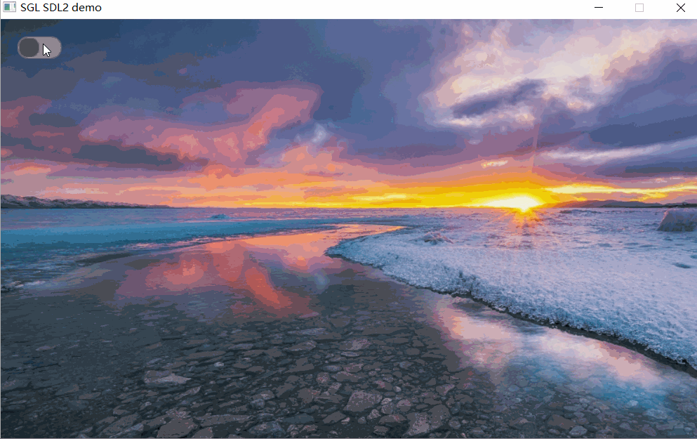

## Creating Switches
Create a switch as follows:
```c
int main(void)
{
    ...
    sgl_obj_t *sw = sgl_switch_create(NULL);
    sgl_obj_set_pos(sw, 20, 20);
    sgl_obj_set_size(sw, 50, 25);
    ...

    while(1) {
        sgl_task_handle();
    };
}
```
The effect is as follows:  


## Setting Rounded Corners
After creating a switch, you can set rounded corners through `SGL_STYLE_RADIUS`:
```c
int main(void)
{
    ...
    sgl_obj_t *sw = sgl_switch_create(NULL);
    sgl_obj_set_pos(sw, 20, 20);
    sgl_obj_set_size(sw, 50, 25);
    sgl_obj_set_style(sw, SGL_STYLE_RADIUS, 14);
    ...

    while(1) {
        sgl_task_handle();
    };
}
```
The effect is as follows:   


## Setting Button KNOB Color
Set the button KNOB color through `SGL_STYLE_KNOB_COLOR`:
```c
int main(void)
{
    ...
    sgl_obj_t *sw = sgl_switch_create(NULL);
    sgl_obj_set_pos(sw, 20, 20);
    sgl_obj_set_size(sw, 50, 25);
    sgl_obj_set_style(sw, SGL_STYLE_RADIUS, 14);
    sgl_obj_set_style(sw, SGL_STYLE_KNOB_COLOR, SGL_COLOR(SGL_DARK_GRAY));
    ...

    while(1) {
        sgl_task_handle();
    };
}
```
The effect is as follows:   


## Setting Borders
By setting the `SGL_STYLE_BORDER_WIDTH` and `SGL_STYLE_BORDER_COLOR` properties, you can set the switch's border width and color:
```c
int main(void)
{
    ...
    sgl_obj_t *sw = sgl_switch_create(NULL);
    sgl_obj_set_pos(sw, 20, 20);
    sgl_obj_set_size(sw, 50, 25);
    sgl_obj_set_style(sw, SGL_STYLE_RADIUS, 14);
    sgl_obj_set_style(sw, SGL_STYLE_KNOB_COLOR, SGL_COLOR(SGL_DARK_GRAY));
    sgl_obj_set_style(sw, SGL_STYLE_BORDER_WIDTH, 2);
    sgl_obj_set_style(sw, SGL_STYLE_BORDER_COLOR, SGL_COLOR(SGL_GREEN));
    ...

    while(1) {
        sgl_task_handle();
    };
}
```
The effect is as follows:   


## Getting Status
Get the switch status using the `sgl_switch_get_status` function. The return value is the switch status, where `false` means off and `true` means on.

## Setting Status
Set the switch status using the `sgl_switch_set_status` function. The parameter is the switch status, where `false` means off and `true` means on.
