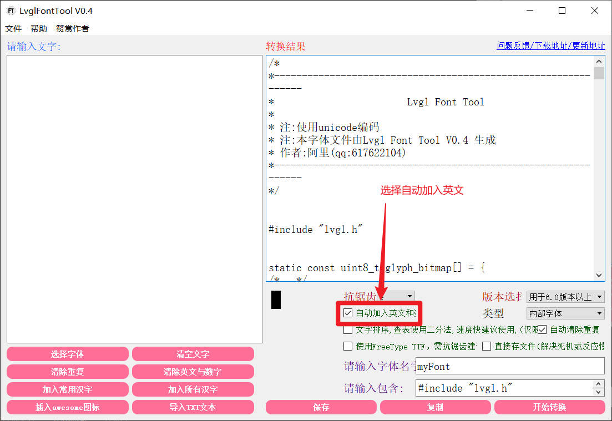
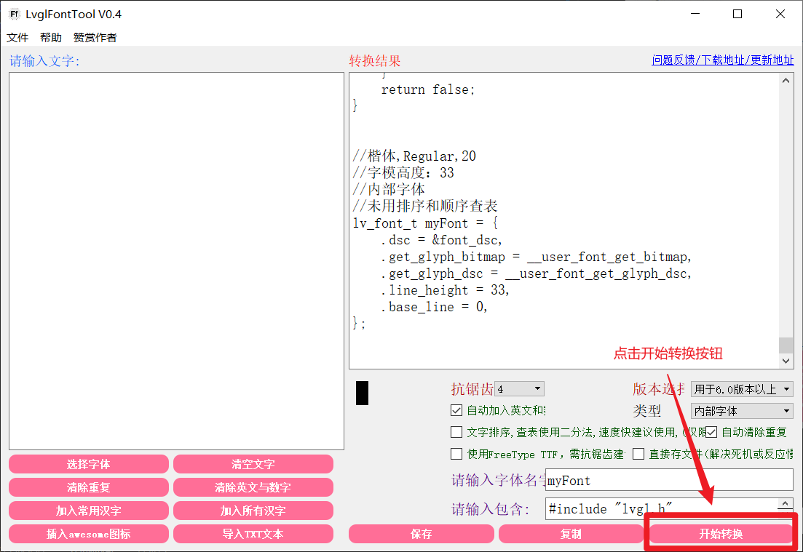
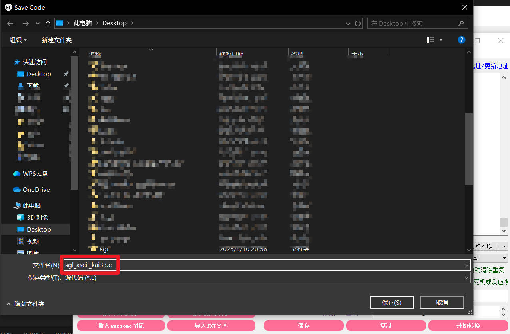
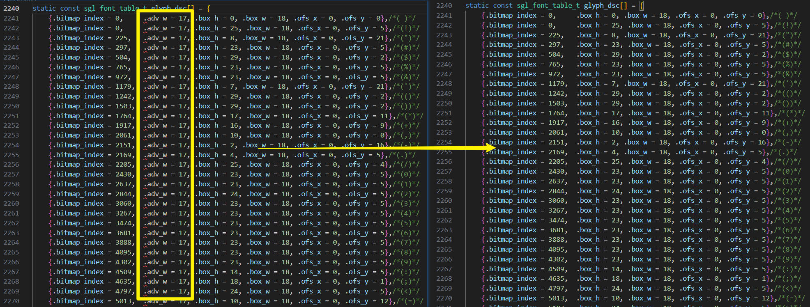

## Creating Fonts
Currently, only the font extraction tool `LvglFontTool` in the tools directory is supported. The specific steps are as follows:

### Steps
#### 1. Run LvglFontTool


#### 2. Select Font
Here we use KaiTi size 20 as an example:   


#### 3. Check Auto Add English


#### 4. Click Convert


#### 5. Save as .c File
Save the converted font as [sgl_ascii_kai33.c](file://c:\Users\lsw\Desktop\sgl\source\fonts\sgl_ascii_kai33.c).   


#### 6. Modify Font File
Place the [sgl_ascii_kai33.c](file://c:\Users\lsw\Desktop\sgl\source\fonts\sgl_ascii_kai33.c) file in the `fonts` folder under the source code directory, open the [sgl_ascii_kai33.c](file://c:\Users\lsw\Desktop\sgl\source\fonts\sgl_ascii_kai33.c) file, and make the following modifications:   
1. Change "lvgl.h" to <sgl_font.h>     


2. Only keep the `glyph_bitmap` and `glyph_dsc` content and `unicode_list_1`, delete everything else, and modify the `glyph_dsc` type to `sgl_font_table_t`, as shown below:   

3. Delete all `adv_w` from the `glyph_dsc` content, as shown below:   


4. Add `sgl_font_t` structure. Copy the font structure template below to the end of the [sgl_ascii_kai33.c](file://c:\Users\lsw\Desktop\sgl\source\fonts\sgl_ascii_kai33.c) file, then fill in the corresponding fields.
    ```c
    sgl_font_t xxx_font = {
        .bitmap = sgl_ascii_xxxx_bitmap,
        .table = sgl_ascii_xxx_tab,
        .font_height = xx,
        .bpp = xx,
    #ifdef CONFIG_SGL_TEXT_UTF8
        .unicode_list = unicode_list_1,
        .unicode_list_len = sizeof(unicode_list_1) / sizeof(unicode_list_1[0])
    #endif        
    };
    ```
    Since our font is `kai33` size font, our `sgl_font_t` structure is as follows:
    ```c
    sgl_font_t kai33 = {
        .bitmap = glyph_bitmap,
        .table = glyph_dsc,
        .font_height = 33,
        .bpp = 4,
    #ifdef CONFIG_SGL_TEXT_UTF8
        .unicode_list = unicode_list_1,
        .unicode_list_len = sizeof(unicode_list_1) / sizeof(unicode_list_1[0])
    #endif        
    };
    ```
#### 7. Add Font Declaration
Add the font declaration in the [sgl_font.h](file://c:\Users\lsw\Desktop\sgl\source\include\sgl_font.h) file:   
   
Then you can use this font.
